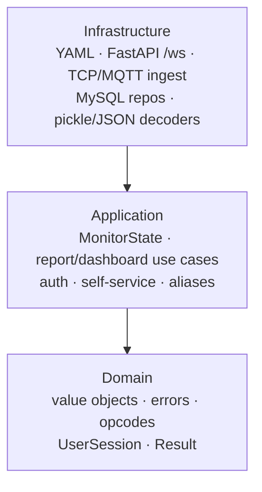
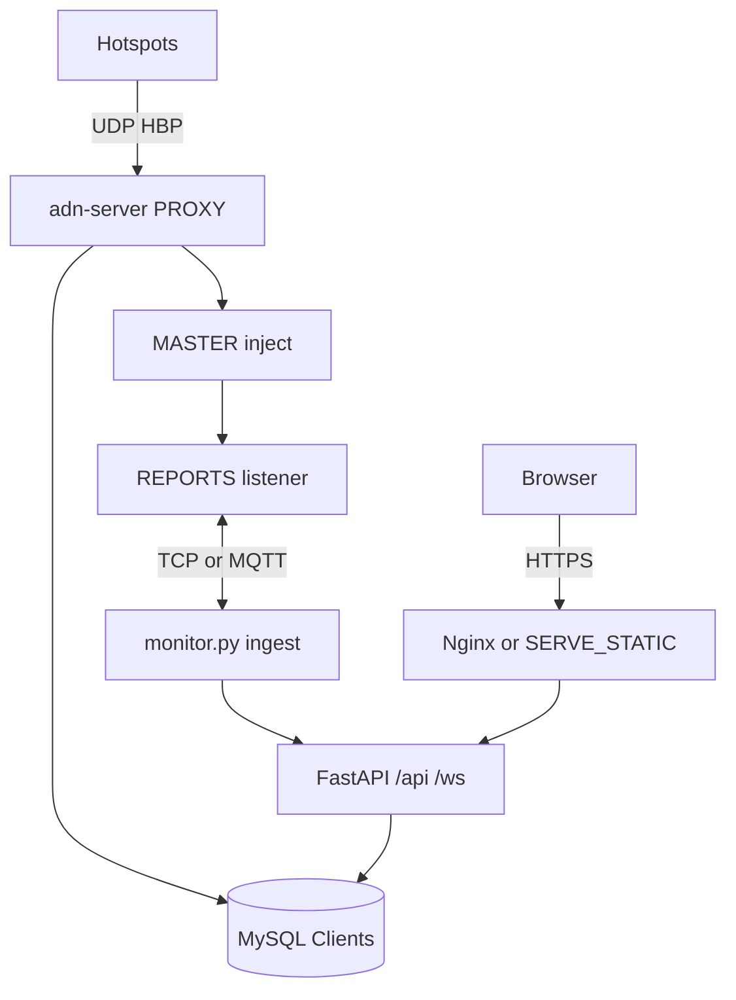

# Architecture and deployment

## Clean architecture (Python monitor)

Under `monitor/src/adn_monitor/`:

- **Domain** — value objects, errors, opcode types, `UserSession`.
- **Application** — `MonitorState`, report/dashboard use cases, auth and self-service, alias service, Last Heard / TG count.
- **Infrastructure** — YAML `load_config`, FastAPI (REST + `/ws`), TCP ingest (Twisted thread) or MQTT, MySQL repositories, pickle/json decoders.

Composition root: `infrastructure/fastapi/composition.py` (`build_monitor_api`).

## Unified process (`monitor.py`)

Single uvicorn/FastAPI process:

| Route / role | Content |
|--------------|---------|
| `/api/*` | Dashboard config, auth, self-service, alias/status proxies |
| `/ws` | `conf,<group>` protocol — CTABLE, Last Heard, voice |
| Ingest (background) | `MONITOR_APP.INGEST`: `tcp` (client to `ADN_CONNECTION`) or `mqtt` |
| Aliases (background) | Download → import with staging + RENAME |

Report ingest connects outbound to **`ADN_CONNECTION.ADN_IP:ADN_PORT`** (TCP) or subscribes to MQTT topics. It updates **CTABLE** / **BTABLE** and persists Last Heard when MySQL is configured.

## Report protocol (from the peer server)

Legacy pickle, v1 HELLO, and v2 slim (`dashboard_state` + `voice_event`) — see [Monitoring and reports](../server/user-guide/monitoring.md).

## Frontend

- **Vite + React** under `frontend/`; build produces static assets served by nginx/Apache or similar.
- Dev: Vite proxies `/api` and `/ws` to `MONITOR_APP.LISTEN_PORT`.
- Production: nginx serves `frontend/dist/` and proxies `/api` + `/ws` to the same FastAPI port.

## Hotspot proxy

**Integrated (default):** **`adn-server.py`** runs UDP fan-in from **`PROXY.LISTEN_PORT`** into **`PROXY.TARGET_SYSTEM`**; **`SELF_SERVICE`** in **`adn-server.yaml`** drives **RPTO** from MySQL **`Clients`**. See [Hotspot proxy (integrated)](../server/user-guide/hotspot-proxy.md).

The standalone **`adn-proxy`** process was removed from the **adn-monitor** repository; use integrated **`PROXY`** only.

## Typical deployment topology

---

## See also

- [Documentation home](../README.md)
- [Configuration](configuration.md)
- [Self-service](self-service.md)
