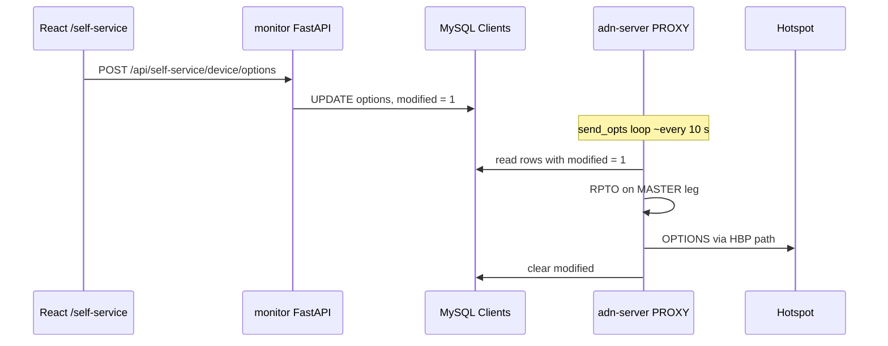

# Self-service

**Self-service** lets a hotspot owner **log in** to the dashboard, **edit their device options** (static TG lists, default reflector, timer, language, etc.), and have those options **pushed to the ADN DMR Peer Server** without manually editing YAML on the server.

It involves **four** pieces: **MySQL** (`Clients` table), **monitor API** (FastAPI session + REST), **React** (`/self-service` page), and the **integrated hotspot proxy** in **adn-server** (periodic **RPTO** to the master). The **peer server** is the component that ultimately applies **RPTO** / **OPTIONS** to the running bridge and hotspot behaviour.

---

## Prerequisites

1. **`SELF_SERVICE`** block in **`adn-monitor.yaml`** with valid **MySQL** credentials and **PBKDF2** parameters matching your password tooling (same salt/iterations as **`hotspot_proxy_self_service.py`** when used).
2. **`DASHBOARD.SELF_SERVICE: true`** so the UI shows the **Self-service** menu entry (and `monitor.py` exposes `/api/self-service/*` when DB connects).
3. **`Clients`** table populated with rows: **`callsign`**, **`int_id`** (DMR ID), **`psswd`** (PBKDF2-SHA256 hex), **`options`** (semicolon-separated `KEY=value`), **`logged_in`**, **`host`**, **`modified`**, etc. (see adn-monitor DB schema / migration scripts in the repo).
4. Hotspot traffic should pass through the **proxy** if you rely on **`modified`** and **RPTO** push (see flow below).

---

## Authentication

| Endpoint | Purpose |
|----------|---------|
| **`POST /api/auth/login`** | Body: `callsign`, `password`. Verifies **PBKDF2** hash against **`Clients.psswd`** for rows with **`logged_in = 1`**. On success: session cookie with **`user_id`**, **`int_ids`** (all DMR IDs for that callsign). |
| **`GET /api/auth/login-by-ip`** | Optional: single user match for **`Clients.host`** = client IP (same session shape). |
| **`POST /api/auth/logout`** | Clears session. |
| **`GET /api/auth/me`** | Returns `{ callsign, int_ids, selected_int_id }` for the React app. |

Session lifetime is extended on activity (**SelfServiceController** uses a long inactivity timeout).

---

## Device API (after login)

| Method | Path | Purpose |
|--------|------|---------|
| **GET** | `/api/self-service/device?int_id=` | Load **`Clients`** row for that **`int_id`** (must be in session **`int_ids`**). Returns JSON: **`int_id`**, **`callsign`**, **`mode`**, **`options`** parsed into TS1/TS2 lists, DIAL, VOICE, LANG, SINGLE, TIMER. |
| **POST** | `/api/self-service/device/options` | Body: **`int_id`**, **`options`** string (Homebrew **OPTIONS** line). Must end with **`;`**. Max length **4096**. Updates DB: **`Clients.options`**, sets **`modified = 1`**. |
| **GET** | `/api/self-service/device/modified?int_id=` | Returns **`{ modified: 0|1 }`** from **`Clients.modified`** (UI can poll until the proxy clears it). |
| **POST** | `/api/self-service/device/select` | Body: **`int_id`** — set session **`selected_int_id`** when the user has multiple devices. |

---

## End-to-end flow (why options reach the hotspot)



1. User saves options in the web UI → **monitor API** writes **`Clients.options`** and **`modified = 1`**.
2. The **hotspot proxy** runs **`send_opts`** on a loop (~every **10 s**). For rows with **`modified = 1`**, it reads options from the DB, sends **RPTO** (options) **to the peer server** at **`(MASTER, assigned_dest_port)`**, then clears **`modified`** in the DB.
3. The **ADN DMR Peer Server** receives **RPTO** on the MASTER leg and updates its **OPTIONS** / bridge state (same path as a normal hotspot registration refresh).
4. The server pushes the appropriate signalling to the **hotspot** so static TG / reflector / timer settings take effect **without** a full hotspot restart (exact behaviour matches the HBP **OPTIONS** flow in the server).

Important: the proxy sends **RPTO to the master only**, not to the hotspot directly. If the proxy is not in the path, you must ensure another mechanism applies **OPTIONS** or you run the server without this proxy path.

> **Prerequisite:** the hotspot must send `PASS=` in its OPTIONS line for
> password login and bidirectional DB sync. If the hotspot sends explicit
> content (TGs, SINGLE, etc.) **without** `PASS=`, the server takes options
> directly from that line and the DB row is ignored. If the hotspot sends no
> RPTO at all (timer expires) or an empty OPTIONS, the server falls back to
> the database.
> See [Hotspot proxy — OPTIONS line behaviour](../server/user-guide/hotspot-proxy.md#options-line-behaviour).

---

## `logged_in` reconciliation

The **`logged_in`** flag gates both **password** and **IP-based** login: only
rows with `logged_in = 1` can authenticate on the dashboard. The **peer
server** keeps this flag accurate by reconciling it against actually connected
peers every **120 s** (the `lst_seen` loop):

- Peers currently connected to the inject-only MASTER get `logged_in = 1`.
- All other rows get `logged_in = 0`.
- The loop starts with `now=True`, so the **first tick at boot clears every
  stale flag immediately** — after a server restart, hotspots that did not
  reconnect cannot authenticate via login-by-IP.

This replaced the legacy hourly `clean_tbl` (24 h idle sweep), which left
`logged_in = 1` for peers no longer connected after a restart.

---

## Password hashing

**`AuthenticateUser`** uses:

```text
hash_pbkdf2('sha256', password, PBKDF2_SALT, PBKDF2_ITERATIONS)
```

stored as hex in **`Clients.psswd`**. The same parameters must be used wherever passwords are **registered** (e.g. **hotspot_proxy_self_service.py** in the **adn-dmr-server** / tooling repo).

---

## UI

- Route **`/self-service`** in the React app (`SelfService.tsx`): loads **`/api/auth/me`**, then device details for **`selected_int_id`**, edit options string, save.
- External **SelfCare** link (e.g. `selfcare.adn.systems`) may appear in the nav as a separate product — not the same as this **local** self-service.

---

## See also

- [Documentation home](../README.md)
- [Configuration](configuration.md) — `SELF_SERVICE`, `DASHBOARD`, `PROXY`
- [Architecture](architecture.md) — proxy + report path
- Hotspot proxy details: **adn-monitor** `proxy/README.md` (RPTO timing table)
