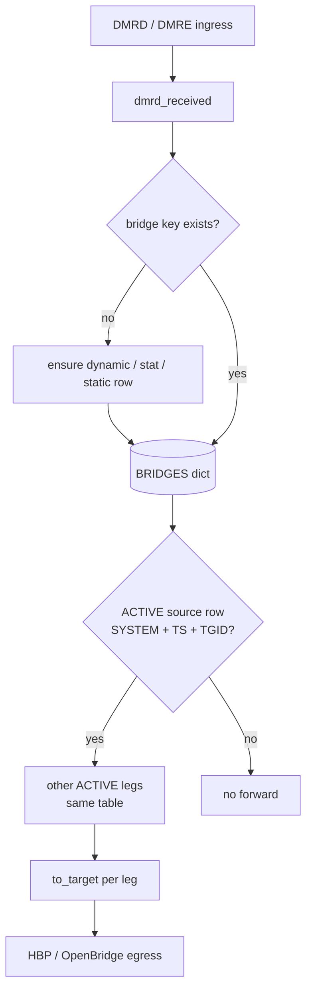
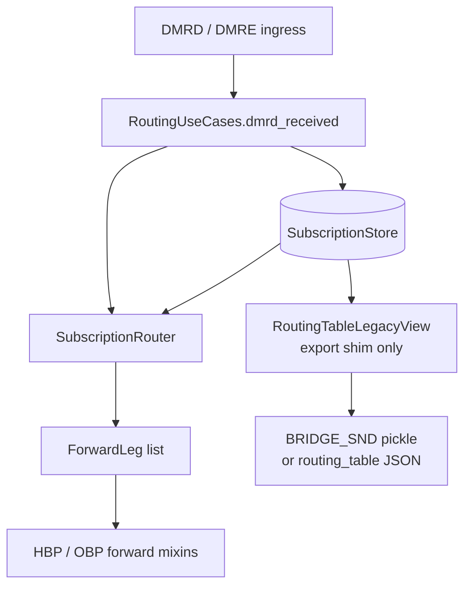

# BRIDGES (legacy) vs Subscriptions (new server)

**adn-dmr-server** and **adn-server 2.x** forward group voice the same way at the wire: a talkgroup “bridge table” decides which **systems** receive a copy of the stream, with **LC rewrite** per leg. What changed in 2.x is **how that table is represented in code** — not the operator-visible rules.

## For operators

Runtime bridge behaviour is unchanged: TGs, slots, OPTIONS, UA, TG 4000, OpenBridge. **Subscriptions** is the internal name for the 2.x routing engine — not a separate operating mode and not something you configure on its own.

**No operational change**

- Configuration: **`SYSTEMS`**, hotspot OPTIONS, **`SELF_SERVICE`** / MariaDB — same as **adn-dmr-server**. Neither stack loads a `BRIDGES` block from YAML.
- Rule parity: ACTIVE source row, `#…` tables, UA timers, `GEN_STAT_BRIDGES`, etc.

**Concrete gains in 2.x**

| Area | Effect |
|------|--------|
| **Routing stability** | Bridge state lives in a dedicated store; reports and timers no longer share the same mutable structure as voice forwarding. Fewer mismatches between what the server forwards and what the dashboard shows under load. |
| **Monitor** | **Report v2** (`routing_table`, `topology`) to **adn-monitor 2.x** replaces pickle/CSV; BTABLE tracks peer state more faithfully. |
| **Dynamic TGs** | With **`DATABASE`**, per-peer dynamics are **persisted** and restored on reconnect (≥ 2.0.0-rc.3). |
| **Maintenance** | Timer, OpenBridge, ACL, and self-service fixes do not go through one process-wide dict shared with every subsystem. |

The word **subscription** only matters when reading code or this guide; on the dashboard and on the air you still work with **bridges** and **talkgroups**.

---

## At a glance

| | **Legacy (`adn-dmr-server`)** | **New (`adn-server` 2.x)** |
|---|------------------------------|----------------------------|
| **Runtime authority** | Global `BRIDGES` dict (`bridge_master.py`) | **`SubscriptionStore`** (domain `Subscription` objects) |
| **Structure** | `bridge_key → [ row, row, … ]` | One **subscription** per system leg on a channel |
| **Forward resolution** | Scan rows, call `to_target` | **`SubscriptionRouter.resolve()`** → `ForwardLeg` |
| **Monitor / report wire** | Pickle `BRIDGE_SND` = `BRIDGES` | JSON `routing_table` (v2) or exported `BRIDGES` shim (v1 compat) |
| **YAML `BRIDGES:` block** | Not loaded from config in either stack; rows are built at runtime | Same — rows come from OPTIONS, UA, STAT, OpenBridge, echo bootstrap |

Observable behaviour (source-row guard, dynamic UA, static TG, reflector keys `#…`, OpenBridge TS1 match, timers) follows **legacy parity** with `bridge_master.py`.

## Legacy: `BRIDGES` dict

In **adn-dmr-server**, routing state is a **process-wide dictionary**:

```text
BRIDGES["52090"] = [
  { "SYSTEM": "MASTER-A", "TS": 2, "TGID": b'...', "ACTIVE": True,  "TO_TYPE": "ON",  "TIMER": …, … },
  { "SYSTEM": "MASTER-B", "TS": 2, "TGID": b'...', "ACTIVE": True,  "TO_TYPE": "ON",  … },
  { "SYSTEM": "OBP-UK",   "TS": 1, "TGID": b'...', "ACTIVE": False, … },
]
BRIDGES["#310"] = [ … ]   # reflector / marked TG tables
```

Each **row** is a leg. Important fields:

- **`SYSTEM`** — configured system name (HBP master or OpenBridge leg).
- **`TS`** — timeslot 1 or 2 (OpenBridge sources use **TS 1** in the match path).
- **`TGID`** — destination ID bytes used for **LC rewrite** toward that leg.
- **`ACTIVE`** — leg participates in forwarding when true.
- **`TIMEOUT` / `TIMER` / `TO_TYPE` / `ON` / `OFF` / `RESET`** — UA timers, static/stat, in-band VTERM rules.

**Voice path (`dmrd_received`):**

1. Derive **bridge key** from destination TG (and reflector `#…` tables when applicable).
2. Create a dynamic table if missing (UA / STAT / static OPTIONS — same triggers as legacy).
3. Find an **ACTIVE source row** matching current **system + slot + TGID**.
4. For each other **ACTIVE** row in **that same table**, call **`to_target`** (contention, ACL, LC/TA rewrite, OpenBridge loop control).



The monitor reads the **same dict** via pickle **`BRIDGE_SND`**.

## New server: `Subscription` + `SubscriptionStore`

In **adn-server 2.x**, the **domain model** replaces ad-hoc dict rows:

- **`AudioChannel`** — logical TG + slot `(tgid, slot)`.
- **`Subscription`** — one system’s participation: **role**, **activation policy**, **state** (phase, timer), **target_tgid** (LC rewrite), optional **`relay_table_key`** (reflector `#…` tables).
- **`SubscriptionStore`** — sole **runtime routing authority** (no parallel `BRIDGES` mutation).

**Voice path** (same semantics, different types):

1. `RoutingUseCases.dmrd_received` updates the store (create relay table, static TG, UA timeout — legacy hooks).
2. **`SubscriptionRouter.relay_tables_with_active_source`** — tables where the ingress system has an **ACTIVE** subscription matching slot/TG.
3. **`SubscriptionRouter.resolve`** — returns **`ForwardLeg`** targets (system, slot, tgid) for all other **ACTIVE** subscriptions in those tables.
4. Forward mixins send packets (`to_target` parity).



**Important:** `routing_table_for_report()` / **`BRIDGE_SND`** is a **one-way export** for dashboards (`RoutingTableLegacyView`). It is **not** used to decide forwards. That avoids the legacy pattern of mutating a global dict shared with reporting.

## Row → subscription mapping

| Legacy `BRIDGES` row | Domain `Subscription` |
|----------------------|-------------------------|
| Table key (`"52090"`, `"#310"`) | `relay_table_key` + channel TG |
| `SYSTEM` | `system` (`SystemId`) |
| `TS` + table TG context | `channel.slot` / `channel.tgid` |
| `TGID` (bytes) | `target_tgid` (LC rewrite) |
| `ACTIVE` | `state.phase` (`ACTIVE` / `IDLE`) |
| `TIMER` | `state.timer_expires_at` |
| `TIMEOUT` | `timeout_seconds` |
| `TO_TYPE` (`ON`, `OFF`, `STAT`, `NONE`) | `role` + `policy` (`ActivationPolicy`, `SubscriptionRole`) |
| `ON` / `OFF` / `RESET` | `triggers` (`InbandTriggers`) |

Import/export helpers: `routing_table_import.py`, `routing_table_export.py` (mirror of legacy `bridges_export`).

## End-to-end comparison (one voice frame)

```mermaid
sequenceDiagram
  participant Radio
  participant Server
  participant Peer as Other system

  Radio->>Server: Group voice TG 52090 TS2

  rect rgb(40,40,50)
    note right of Server: Legacy
    Server->>Server: BRIDGES["52090"] source row ACTIVE?
    Server->>Server: foreach ACTIVE leg in table
    Server->>Peer: to_target (rewrite LC)
  end

  rect rgb(30,50,40)
    note right of Server: New server (same rules)
    Server->>Server: SubscriptionRouter.resolve()
    Server->>Peer: forward ForwardLeg(s)
  end
```



## What did **not** change

- Bridge **keys** (`52090`, `#reflector`, …) and **multi-leg tables**.
- **Source-row guard** — forward only from a table where **this** system is an ACTIVE source for that TG/slot context.
- **Dynamic UA**, **static OPTIONS**, **`GEN_STAT_BRIDGES`**, **TG 4000** clearing, **echo 9990** bootstrap.
- Timer passes (`rule_timer`, `bridgeDebug`, …) — still driven off the same logical table, implemented on the store in 2.x.

## Concrete example

**Bridge** (network concept): “TG 52090 connects these systems and forwards voice between them”.  
**Subscription** (2.x code only): **one leg** of that table — e.g. “MASTER-A on TG 52090, slot 2, ACTIVE, with its LC and timer”.

It is not bridge *or* subscription: in 2.x a bridge **is** a set of subscriptions on the same channel (TG + slot).

### Scenario

Someone keys **TG 52090** and **MASTER-A**, **MASTER-B**, and an **OpenBridge** leg should hear it. On the dashboard and on the air that is a **bridge** (the TG 52090 table).

**Legacy (`adn-dmr-server`)** — everything in one global dict:

```text
BRIDGES["52090"] = [
  { SYSTEM: "MASTER-A", TS: 2, ACTIVE: True,  TGID: …, TIMER: … },
  { SYSTEM: "MASTER-B", TS: 2, ACTIVE: True,  TGID: … },
  { SYSTEM: "OBP-UK",   TS: 1, ACTIVE: False, TGID: … },
]
```

When a voice frame arrives:

1. Find the row where **this** system is the **ACTIVE** source (same TG/slot).
2. Walk the **other ACTIVE rows** in the same table.
3. For each, call **`to_target`** → forward with rewritten LC.

The monitor reads **the same dict** (pickle **`BRIDGE_SND`**).

**New server (`adn-server` 2.x)** — same table, different internal shape:

```text
SubscriptionStore — TG 52090 / slot 2:
  - subscription MASTER-A  (ACTIVE, target_tgid, timer…)
  - subscription MASTER-B  (ACTIVE, …)
  - subscription OBP-UK    (IDLE, …)
```

On voice, **`SubscriptionRouter.resolve()`** applies the **same rules** (ACTIVE source, other ACTIVE legs) and returns **`ForwardLeg`** entries to forward. The monitor gets an **exported view** (`BRIDGE_SND` or JSON **`routing_table`**); that export does **not** drive forwarding.

## Where to read code

| Topic | Legacy | New |
|-------|--------|-----|
| Voice ingress | `adn-dmr-server/bridge_master.py` (`routerHBP.dmrd_received`) | `application/routing_use_cases.py` |
| Forward to leg | `to_target` | `application/routing/hbp_forward.py`, `obp_forward.py` |
| Table state | global `BRIDGES` | `application/subscription/` (`store`, `router`, ops) |
| Monitor export | `send_routing_table` / pickle | `routing_table_legacy_view.py`, report v2 `routing_table` |

See also: [Bridges and talkgroups](../user-guide/bridges-and-talkgroups.md), [Architecture](architecture.md), [Performance (2.x)](performance.md), [Report protocol v2](../protocols/report-v2.md#routing_table).
