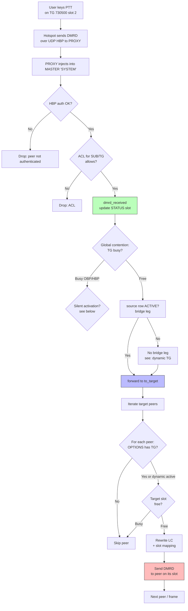
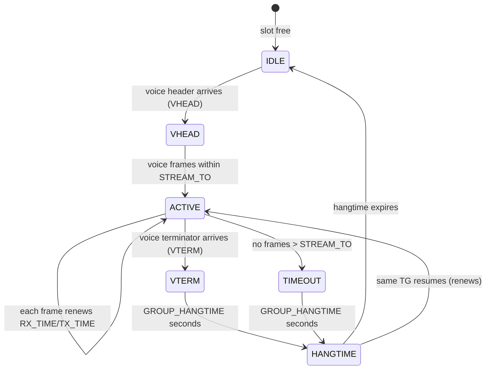
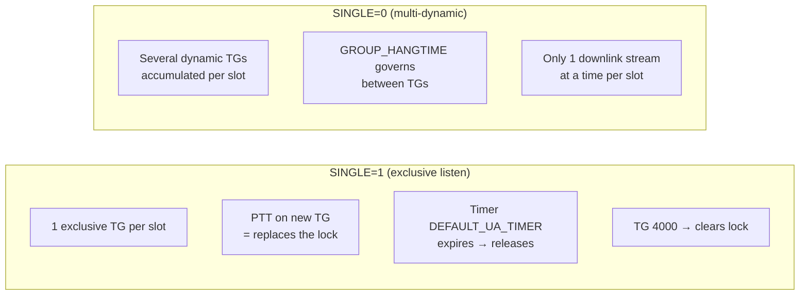
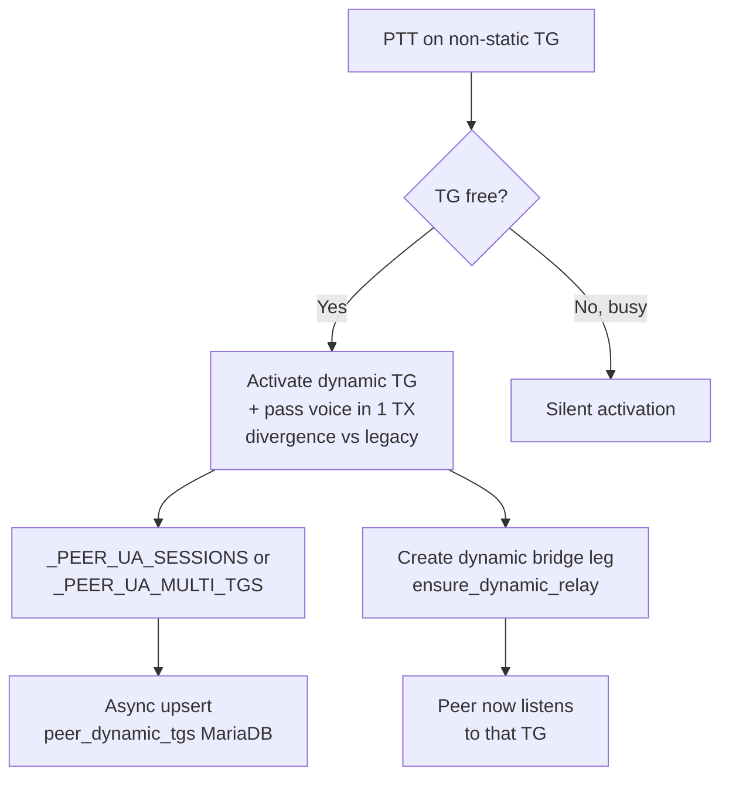
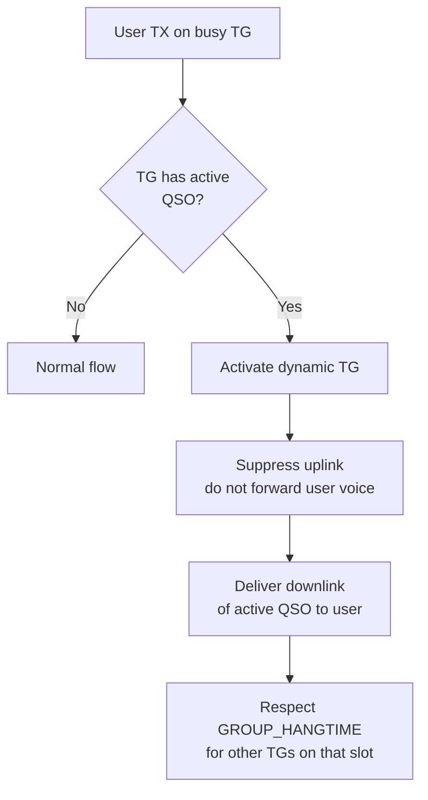
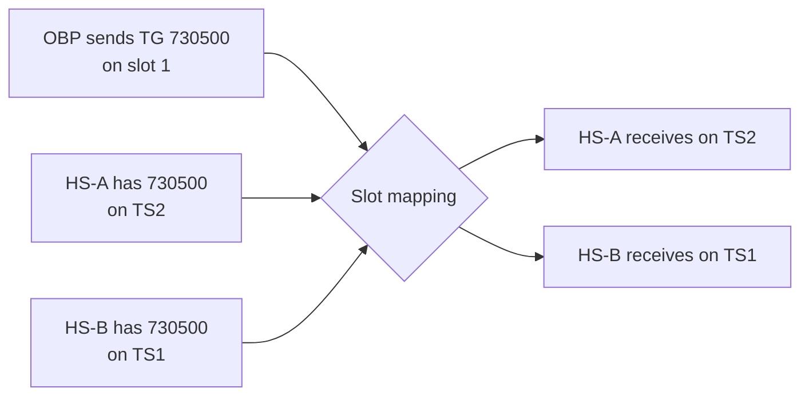
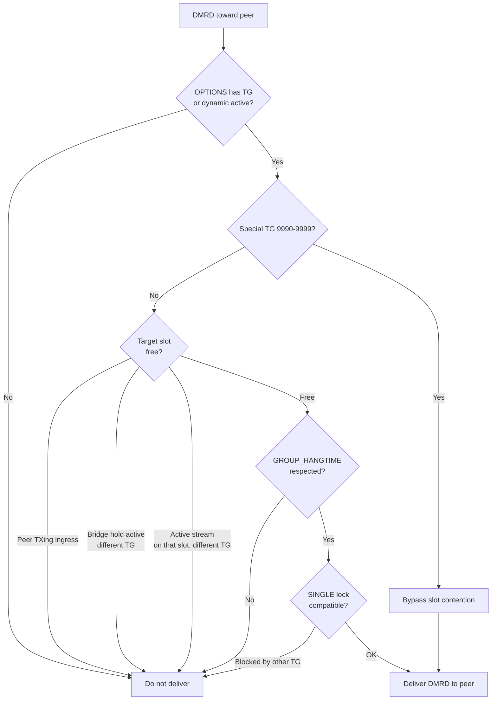

# Voice routing and contention rules

This page documents **how voice frames travel through the server** and the
**contention / slot rules** that govern who hears what. It is the reference
for sysops and integrators who need to understand or troubleshoot routing
behaviour without reading source code.

The server maintains **legacy parity** with `adn-dmr-server` (`bridge_master.py`)
except for the explicitly documented divergences at the end of this page.

---

## Golden rule: one conversation per TG

**Only one conversation per TG may exist on the server at a time.** This rule
is **global** — it applies regardless of slot, peer, or traffic origin (OBP or
HBP). It has the highest priority; all other rules are subordinate to it.

A TG is **busy** when it has an **active** voice stream (frames within
`STREAM_TO` of the last packet) on any slot, from any source.

| New traffic source | Behaviour |
|---|---|
| Another **OBP** sends the same TG | **Reject** — TG already busy |
| A **hotspot (HBP)** keys the same TG | **Reject**, *or* silent activation (see below) |

The only exception is **silent activation**, which does **not** create a second
conversation — it only lets the user listen to the existing one.

---

## End-to-end packet flow



### Decision points in order

1. **HBP authentication** — the peer must be registered with a valid passphrase.
2. **ACL** — `SUB_ACL`, `TGID_TS1_ACL`, `TGID_TS2_ACL` (when `USE_ACL`).
3. **`dmrd_received`** — updates `STATUS[slot]`: `RX_TIME`, `RX_TGID`,
   `RX_STREAM_ID`, `RX_TYPE`, `RX_PEER`.
4. **Global contention** — if the TG already has an active stream from another
   source, it is blocked or silently activated.
5. **Source row ACTIVE** — a bridge leg must exist and be `ACTIVE` for that
   `system/slot/TG`. If missing, a dynamic one is created.
6. **Fan-out** — for each peer on the MASTER, the downlink gate decides if it
   receives the packet.
7. **LC rewrite + slot mapping** — the destination slot is the peer's, not the
   source's.

---

## The four contention rules (legacy parity)

Evaluated **packet by packet** in `to_target` against the `STATUS[slot]` of the
target system. These match `bridge_master.py` lines ~2076–2104.

| Rule | Condition | Action |
|---|---|---|
| **1. RX hangtime** | TG ≠ `RX_TGID` **and** `(now - RX_TIME) < GROUP_HANGTIME` | `continue` (do not forward) |
| **2. TX hangtime** | TG ≠ `TX_TGID` **and** `(now - TX_TIME) < GROUP_HANGTIME` | `continue` |
| **3. same TG RX active** | TG == `RX_TGID` **and** `(now - RX_TIME) < STREAM_TO` **and** different stream | `continue` |
| **4. same TG TX, other sub** | TG == `TX_TGID` **and** `(now - TX_TIME) < STREAM_TO` **and** other subscriber | `continue` |

Key facts:

- `RX_TIME`, `RX_TGID`, `TX_TIME`, `TX_TGID` are **not cleared on VTERM**. They
  keep the last value until another QSO overwrites them — that is why hangtime
  counts from the last packet.
- Contention is evaluated per-frame, not per-stream. If a stream was blocked by
  hangtime and the hangtime then expires, subsequent frames of the same stream
  **are** forwarded.
- The `CONTENTION` flag in legacy is only a log debounce; it does not block.

---

## Critical timeouts and constants

These values define observable behaviour. Changing them affects contention,
hangtime, and reconnect.

| Constant | Value | Location | Role |
|---|---|---|---|
| `STREAM_TO` | **0.36 s** | `domain/hbp_protocol.py` | Window to consider a stream "active" (between packets). |
| `_STALE_PEER_SESSION_TIMEOUT` | **5.0 s** | `routing/helpers.py` | A per-peer session with no frames is considered dead (VTERM lost). |
| `GROUP_HANGTIME` | **5 s** (config default) | per-system YAML | Blocking period after a QSO ends before another TG is accepted on that slot. |
| `DEFAULT_UA_TIMER` | configurable (minutes) | per-system YAML | Duration of dynamic (User Activated) bridges. |

See [Behaviour and timers](behaviour-and-timers.md) for the periodic loop
intervals (`rule_timer`, `stream_trimmer`, etc.).

### Stream states



**Lost VTERM:** if the MMDVM never sends a terminator, the per-peer session
expires after `_STALE_PEER_SESSION_TIMEOUT` (5 s), freeing the slot.

---

## SINGLE=1 vs SINGLE=0 (exclusive listen)

`SINGLE` is set in the hotspot's `OPTIONS` line (e.g. `SINGLE=1;`). It controls
**how many dynamic TGs a peer can have active per slot**.



| Aspect | SINGLE=1 | SINGLE=0 |
|---|---|---|
| Dynamic TGs per slot | **1 exclusive** | **Several accumulated** (`_PEER_UA_MULTI_TGS`) |
| Storage | `_PEER_UA_SESSIONS[peer][slot]` | `_PEER_UA_MULTI_TGS[peer][slot]` |
| Switching TG | PTT on new TG replaces the lock | Adds to the set; does not replace |
| TG 4000 | Clears the slot session | Clears all the peer's dynamics |
| Timer | `DEFAULT_UA_TIMER` expires → releases | No individual expiry; purged by `GROUP_HANGTIME` |
| In-band deactivation | Aggressive: OFF/RESET/TG4000/non-matching traffic | Conservative: mainly TG 4000 |

### SINGLE exceptions

- **TG 9990 (echo):** does **not** create a SINGLE lock. Echo always returns to
  the caller.
- **TG 4000:** does **not** create a UA session. It is a reset command only.
- **TG 9991–9999 (on-demand):** do not create a SINGLE lock.
- **Own UA session:** a SINGLE=1 peer that activated TG T dynamically **must**
  receive downlink for T (it does not self-block).

---

## Static vs dynamic talkgroups

### Static TG

Defined in the hotspot's `OPTIONS` (`TS1_STATIC` / `TS2_STATIC`). The peer
always listens to that TG on that slot while connected.

```
OPTIONS: TS1=730500;TS2=730502,730508;SINGLE=1;TIMER=60;
```

Origins of static TGs:

- **OPTIONS at login (RPTO)** — the hotspot reports its line.
- **Self-service (web panel)** — the user changes TGs from the browser; the
  server sends an updated `RPTO` to the MASTER.
- **Startup/reload** — `apply_startup_bridges` applies TGs at start and on
  `SIGHUP`.
- **D-28 (divergence):** there is **no** periodic 26 s loop
  (`options_config_loop`). Refresh is event-driven (RPTO, startup, dmrd
  no-source fallback).

### Dynamic TG (User Activated)

Activated when a user keys a TG that is **not** in their static OPTIONS.



**Difference vs legacy (`adn-dmr-server`):**

- **Legacy:** two TXs are needed — the 1st activates, the 2nd passes voice.
- **This server:** the 1st TX does both (activate + pass voice).

See [Dynamic TG persistence (MariaDB)](../user-guide/bridges-and-talkgroups.md#dynamic-tg-persistence-mariadb)
for reconnect survival.

---

## Silent activation (TG busy with active QSO)

**Intentional divergence.** If a user keys a TG that has an **active**
conversation, the server:

1. Does **not reject** the TX.
2. **Activates** that TG as dynamic.
3. Does **not forward the user's uplink** (does not disturb the active QSO).
4. **Does deliver the downlink** of the active QSO to the user immediately.



Applies to:

- **Non-static TG** the user wants to hear.
- **SINGLE=1** switching from an active TG to another with an ongoing QSO.

---

## Slot mapping on downlink

The slot on which a peer **receives** a TG is determined by its `OPTIONS` (if
static) or the slot where it activated it (if dynamic). It is **not** the slot
of the originating transmission.



- **OBP always travels on slot 1** of the packet. The slot is informational of
  the origin; delivery goes to the peer's slot.
- Two peers with the same TG on different slots can **both** hear the same
  transmission, each on its own slot.
- On **simplex (DMO)**, MMDVMHost drops packets with the TS1 bit set; the server
  delivers downlink voice on **TS2** for simplex peers.

---

## Downlink gate: does a peer receive the packet?

For each peer and each group voice frame, the server evaluates a chain of
filters. **All** must pass for the packet to be delivered.



### Conditions that block downlink (per-peer)

| Condition | Detail |
|---|---|
| **Active ingress** | The peer is transmitting on that slot → no receive until TX ends. |
| **Bridge hold** | The slot has a `bridge_hold` (own ingress or listener) blocking foreign TGs for `GROUP_HANGTIME`. |
| **Active stream, different TG** | A downlink stream is already active on that slot with another TG → wait for it to end. |
| **GROUP_HANGTIME** | If the last TG on that slot was different and is within hangtime → block. |
| **Incompatible SINGLE lock** | SINGLE=1 with a lock on another TG → block, unless it is the lock TG or the peer activated it. |
| **Stale session** | If the per-peer session has had no frames for `_STALE_PEER_SESSION_TIMEOUT`, it is purged and the slot frees. |

### Mid-call join

When a downlink stream ends (VTERM or timeout), the peer's slot becomes free.
The **next frame** of any other TG the peer has active (static or dynamic) and
that is currently in progress on the network **is delivered without requiring a
new PTT**.

This does **not relax** any rule: GROUP_HANGTIME, SINGLE, and per-peer
contention are evaluated exactly as for any stream. It is simply the normal
behaviour when the slot becomes free.

---

## OpenBridge and dynamic TGs

If a hotspot on server 7302 activated TG 7300 dynamically and a hotspot on
7301 keys that TG, the OBP traffic must reach the 7302 hotspot even though 7300
is not in its OPTIONS. The bridge leg is activated by the UA session (via
`master_dynamic_tg_slots`), which checks both `_PEER_UA_SESSIONS` (SINGLE=1)
and `_PEER_UA_MULTI_TGS` (SINGLE=0).

See [OpenBridge protocol](../protocols/openbridge.md) for ingress filters,
BCSQ/BCKA, and DMRE v5 details.

---

## Divergences vs legacy

| Behaviour | Legacy (`adn-dmr-server`) | This server |
|---|---|---|
| Activate dynamic TG (free TG) | 2 TXs: 1st activates, 2nd passes voice | 1 TX: activates + passes voice |
| TX on busy TG | Blocked by contention (rules 1–4) | Silent activation: activates TG, no uplink, delivers downlink |
| Stream end → join active TG | Peer stays in hangtime; no mid-stream join | When the stream ends, the next active TG is delivered without a new PTT |
| OPTIONS refresh (26 s loop) | `options_config_loop` every 26 s | **D-28:** event-driven (RPTO, startup, dmrd fallback) — no periodic loop |
| `GROUP_HANGTIME` | RX + TX, per-system, no reset on VTERM | **Parity** (same behaviour) |
| `OPTIONS` overrides `GROUP_HANGTIME` | No | **Parity** (cannot) |

---

## See also

- [Bridges and talkgroups](../user-guide/bridges-and-talkgroups.md) — the
  `BRIDGES` / subscription model.
- [Special numbers](../user-guide/special-numbers.md) — TG 4000, 999x, echo.
- [Behaviour and timers](behaviour-and-timers.md) — periodic loop intervals.
- [BRIDGES vs Subscriptions](bridges-vs-subscriptions.md) — internal model.
- [OpenBridge protocol](../protocols/openbridge.md) — DMRE v5, ingress filters.
- [Hotspot proxy](../user-guide/hotspot-proxy.md) — integrated PROXY / self-service.
