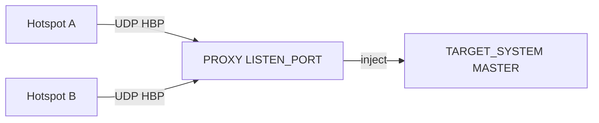

# Hotspot proxy (integrated)

**ADN DMR Peer Server** includes an **integrated hotspot proxy**: one process (`adn-server.py`) accepts Homebrew (HBP) from many hotspots on a single UDP port and **injects** traffic into a configured **MASTER** system. You do **not** need a separate **`adn-proxy`** process when this mode is enabled.

Configuration lives in **`adn-server.yaml`** under **`PROXY`** and optional **`SELF_SERVICE`** (same MySQL **`Clients`** table as **adn-monitor**).

---

## When to use it

| Deployment | What to run |
|------------|-------------|
| **Typical ADN stack** (monitor + dashboard + many Pi-Star hotspots) | **`adn-server.py`** with **`PROXY`** + **`SELF_SERVICE`**. |

The integrated proxy uses **fan-in**: hotspots only need **`PROXY.LISTEN_PORT`** (e.g. **62031**). The target **MASTER** is **inject-only** — it does **not** bind its own UDP port for that system (no per-hotspot port range on the server host).



---

## Optional dependency (self-service)

MySQL self-service requires **`mysqlclient`**:

```bash
pip install -e ".[selfservice]"
```

If **`USE_SELFSERVICE: true`** but **`mysqlclient`** is missing, startup fails with a clear error. Set **`USE_SELFSERVICE: false`** to run the proxy without DB (no dashboard-driven **RPTO** updates).

---

## `PROXY` keys

| Key | Role |
|-----|------|
| **LISTEN_PORT** | UDP port where **hotspots** connect (the address users configure on the hotspot). |
| **LISTEN_IP** | Bind address; empty = all interfaces. |
| **TARGET_SYSTEM** | Name of the **`SYSTEMS`** **MASTER** entry that receives injected HBP (must exist and be **ENABLED**). |
| **TIMEOUT** | Idle session timeout (seconds); expired sessions are torn down on the MASTER. |
| **DEBUG** | Verbose packet logging. |
| **CLIENT_INFO** | Log connect/disconnect per radio ID. |
| **BLACK_LIST** | Block listed radio IDs. |
| **IP_BLACK_LIST** | Block source IPs (with optional expiry). |

There is **no** **`MASTER`**, **`PORT`**, or **`GENERATOR`** in integrated **`PROXY`** — those belong to the legacy standalone proxy. The target MASTER uses **`MAX_PEERS`** (not a UDP port range) to cap concurrent hotspot sessions.

Example (from `adn-server.example.yaml`):

```yaml
PROXY:
  LISTEN_PORT: 62031
  LISTEN_IP: ""
  TARGET_SYSTEM: SYSTEM
  TIMEOUT: 30
  DEBUG: false
  CLIENT_INFO: true
  BLACK_LIST: []
  IP_BLACK_LIST: {}
```

### Inject-only target MASTER

When **`PROXY.TARGET_SYSTEM`** points at a system (e.g. **`SYSTEM`**), startup **removes** **`IP`** / **`PORT`** from that MASTER block. Hotspots never connect directly to the conference port; all HBP enters via **`LISTEN_PORT`**.

Set **`MAX_PEERS`** on the target MASTER to the maximum concurrent proxied hotspots (e.g. **102**). Other MASTER systems (e.g. **ECHO**, **D-APRS**) keep normal **`IP`** / **`PORT`** binds if they are not the proxy target.

---

## `SELF_SERVICE` keys

Same semantics as **`adn-monitor.yaml`** — shared **`Clients`** table, **`modified`** flag, **RPTO** toward the MASTER.

| Key | Role |
|-----|------|
| **USE_SELFSERVICE** | Enable MySQL-backed options sync (`true` / `false`). |
| **PBKDF2_SALT**, **PBKDF2_ITERATIONS** | Must **match** monitor/backend for password hashing. |

MariaDB connection settings live in the top-level **`DATABASE`** block (shared with dynamic TG persistence) — see [Configuration](configuration.md#database-mariadb).

On startup the server logs **`(SELF_SERVICE) Database connection test: OK`** and **`(SELF_SERVICE) Enabled`** when the pool connects. Self-service runs **asynchronously**; voice forwarding is not blocked on DB latency.

Details of the dashboard flow: [Self-service](../../monitor/self-service.md).

---

## Multi-hotspot behaviour

- Each authenticated hotspot is a **peer** on the inject-only MASTER with its own **OPTIONS** (static TGs). **Repeat** and monitor fan-out respect **per-peer OPTIONS** — traffic for a TG is not sent to peers that did not select it.
- **Parrot / echo** talkgroups **9990–9999** bypass the OPTIONS filter and return to the **calling** hotspot (see [Special numbers](special-numbers.md)).

---

## Hot reload (`SIGHUP`)

**Applied without restart** (active proxy sessions stay up):

- **`PROXY`:** **TIMEOUT**, **DEBUG**, **CLIENT_INFO**, **BLACK_LIST**, **IP_BLACK_LIST**
- **`SELF_SERVICE`:** merged into config (credential changes take effect on new DB operations; loops are not restarted on reload)

**Requires full process restart:**

- **`PROXY.LISTEN_PORT`** / **`LISTEN_IP`** (bind change is logged and ignored at reload)
- **`PROXY.TARGET_SYSTEM`**
- Enabling or disabling **`USE_SELFSERVICE`** after startup (start/stop MySQL loops)

See [Configuration — hot reload](configuration.md#hot-reload-adn-serveryaml).

---

## See also

- [Configuration](configuration.md) — full **`adn-server.yaml`** reference.
- [Monitoring and reports](monitoring.md) — TCP reports, dashboard, log rotation.
- [Self-service](../../monitor/self-service.md) — **`Clients`**, **RPTO** timing.
