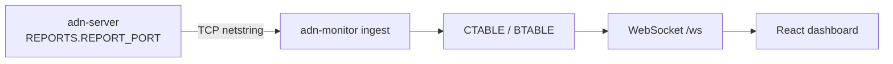

# Monitoring and reports

## TCP report channel

When **`REPORTS`** is enabled in the server config, the **ADN DMR Peer Server** listens on TCP and **report clients** (typically **adn-monitor**) connect and receive:

- **HELLO** (opcode **`0xFF`**) — JSON sent **first** on each new TCP connection by **ADN DMR Server** (`adn-server`): `server` name, package **`version`**, **`protocol`** number, and **`features`** (e.g. `INGRESS`, `END_TX_FORWARD`, `PUSH_ON_CONNECT`). Lets the monitor tag the session as **v2** before any pickled payloads.
- **Report v1 (1.0.x pair):** **CONFIG_SND** / **BRIDGE_SND** (pickle), **BRDG_EVENT** (CSV).
- **Report v2 (2.x pair):** **TOPOLOGY_SND** / **ROUTING_TABLE_SND** (JSON), **VOICE_EVENT_SND**, optional **DELTA_SND** — same triggers (connect, **`CONFIG_REQ`** / **`BRIDGE_REQ`**, reload, peer changes, **`REPORT_INTERVAL`**).

**Report v2:** typed JSON (`topology`, `routing_table`, `voice_event`, `delta`) replaces pickle/CSV on the **2.x** server+monitor pair. Schema: [Report protocol v2 (JSON)](../protocols/report-v2.md).

**Version pairing:** **server 1.0.x + monitor 1.0.x** = report v1 (frozen tags). **server 2.x** emits **report v2 only** — requires **monitor 2.x** on the same line. No `dual` wire; monitor 1.0.x will not decode this server.

Older stacks (**legacy** `adn-dmr-server`-style) may **omit** HELLO. **adn-monitor** waits up to **`ADN_CONNECTION.HELLO_TIMEOUT_MS`** (see [Monitor configuration](../../monitor/configuration.md#adn_connection)); if no HELLO arrives, it assumes **legacy** reporting.

The **monitor** decodes these messages, updates its **CTABLE** / **BTABLE**, and (when MySQL is configured) persists Last Heard / statistics.

**Full stack:** [ADN Monitor overview](../../monitor/index.md) (FastAPI monitor, WebSocket, self-service).



### Report channel log lines (`adn-monitor` logger)

Python uses the logger name **`adn-monitor`** (see **`LOGGER.LOG_FILE`** in `adn-monitor.yaml`). Typical **INFO** lines for the TCP report client:

| Log prefix / text | Meaning |
|-------------------|---------|
| `(REPORT) Connection to report server established` | TCP session up; HELLO wait timer starts (**`HELLO_TIMEOUT_MS`**). |
| `(REPORT) stringReceived: HELLO opcode=ff …` | Raw HELLO frame seen on the wire. |
| `(REPORT) HELLO received: mode=v2 server=… version=… features=…` | HELLO JSON parsed; session treated as **v2** (**ADN DMR Server**). |
| `(REPORT) No HELLO in …s; assuming legacy adn-dmr-server …` | No **`0xFF`** before timeout — monitor keeps **legacy** mode (pickled CONFIG/BRIDGE only). Expected if the peer is classic **`adn-dmr-server`**. If you **know** the server is **ADN DMR Server** but still see this, check **`ADN_IP`** / **`ADN_PORT`**, **`REPORTS.REPORT_CLIENTS`**, firewalls, or raise **`HELLO_TIMEOUT_MS`** slightly on very slow links. |
| `(REPORT) CONFIG applied: …` / `(REPORT) BRIDGES applied: …` | Pickled snapshots applied to CTABLE/BTABLE. |

At **WARNING**: invalid HELLO JSON (`(REPORT) HELLO payload not valid JSON`), or **`Invalid GLOBAL.TIMEZONE`** if **`GLOBAL.TIMEZONE`** in YAML is not a valid IANA name.

## OpenBridge monitor semantics

- **`GROUP VOICE,INGRESS,RX`** — first sight of a stream on an OpenBridge **leg** (debug; full visibility in logs).
- **`GROUP VOICE,START,RX`** — **canonical** start after **loop control** (feeds dashboard chips / CTABLE).
- **`GROUP VOICE,END,…`** — call end; RX/TX variants depending on direction.

The dashboard shows **operational** state from **START** (canonical); the **Monitor** log shows **INGRESS** plus **START** for troubleshooting mesh duplicates.

## Log file rotation (logrotate)

After **logrotate** renames or moves a log file (common pattern: **`create`** so the old path is rotated away and a **new empty file** appears at the configured path), the process may still hold an open file descriptor on the **previous inode**. Logs then appear “missing” from the current path until the process **reopens** its file handlers.

**Recommended:** use **`create`** (not **`copytruncate`** when the service supports signaling): **`copytruncate`** can race with concurrent writes and drop lines; **`WatchedFileHandler`** avoids signals but adds overhead per log record.

These processes handle **`SIGUSR2`** by reopening **`logging.FileHandler`** streams only — **they do not reload YAML**, databases, or Twisted configuration.

| Process | Typical config keys |
|---------|---------------------|
| **`adn-server`** / **`adn-echo`** | **`LOGGER.LOG_FILE`** (integrated proxy logs appear in the same file) |
| **`adn-monitor`** | **`LOG.PATH`** + **`LOG.LOG_FILE`** in `adn-monitor.yaml` |

Example **`/etc/logrotate.d/adn`** fragment (adjust paths and service names):

```text
/var/log/adn-server/adn-server.log {
    weekly
    rotate 12
    compress
    delaycompress
    missingok
    notifempty
    create 0640 adn adn
    postrotate
        /bin/kill -USR2 "$(systemctl show adn-server.service -p MainPID --value)" 2>/dev/null || true
    endscript
}
```

Repeat **`postrotate`** with **`kill -USR2`** for **`adn-echo`** and **`adn-monitor`** units if those logs are rotated on the same host. Use the correct **PID** (systemd **`MainPID`**, a pidfile, or **`kill`** targeting the process you manage).

## Requirements

- Network reachability from the **monitor host** to the server’s **`REPORTS.REPORT_PORT`** (and the server’s **`REPORT_CLIENTS`** allow list must include the monitor if used).
- **adn-monitor** `ADN_CONNECTION.ADN_IP` / **`ADN_PORT`** must match the server — see [Monitor configuration](../../monitor/configuration.md#adn_connection).

## Self-service and hotspots

Operators editing **device options** from the dashboard use the **self-service** flow (MySQL **`Clients`**, **RPTO** toward the conference MASTER). In current **ADN DMR Peer Server** deployments this runs **inside `adn-server.py`**: configure **`SELF_SERVICE`** and **`PROXY`** in **`adn-server.yaml`** (see [Hotspot proxy](hotspot-proxy.md)). Dashboard semantics: [Self-service](../../monitor/self-service.md).

Hotspot proxy logs are part of **`adn-server`** when **`PROXY`** is enabled — see [Hotspot proxy (integrated)](hotspot-proxy.md).
