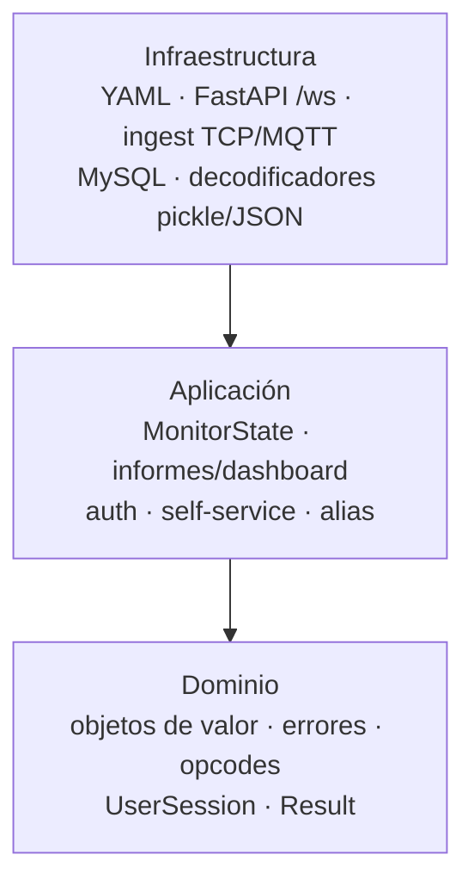
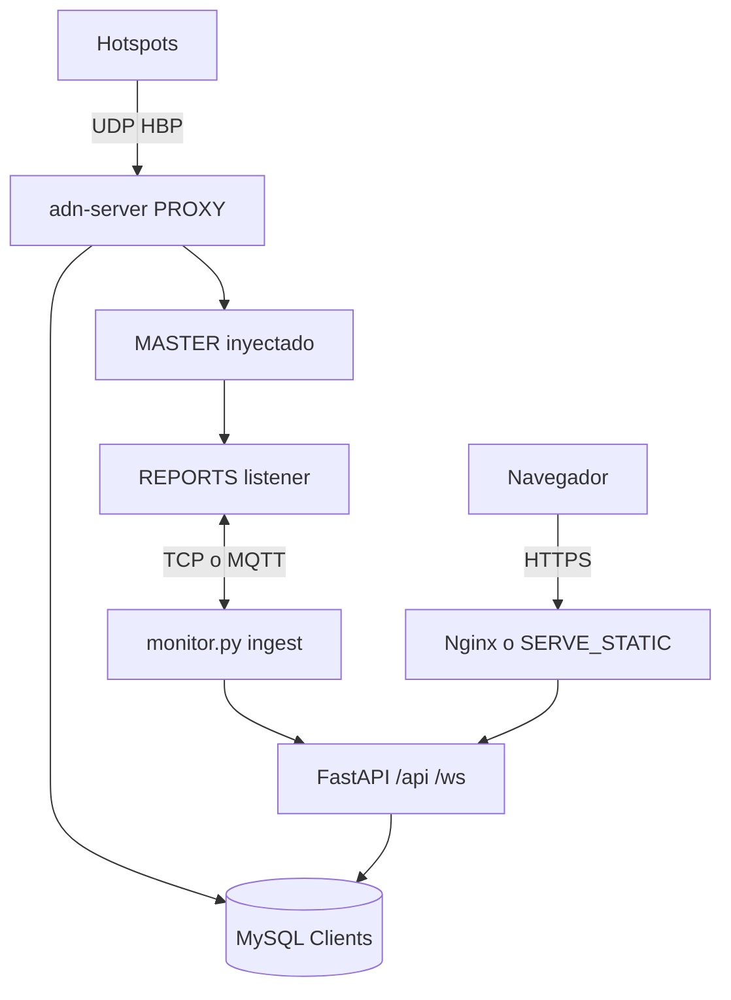

# Arquitectura e implantación

## Arquitectura limpia (monitor Python)

Bajo `monitor/src/adn_monitor/`:

- **Dominio** — entidades, errores, `Result`, opcodes, `UserSession`.
- **Aplicación** — `MonitorState`, casos de uso (auth, self-service, informes, dashboard), puertos (`AuthRepository`, `HttpFetcherPort`, …).
- **Infraestructura** — YAML, FastAPI (REST + `/ws`), ingest TCP (Twisted en hilo) o MQTT, MySQL, decodificadores de informes.

El **composition root** está en `infrastructure/fastapi/composition.py` (`build_monitor_api`).

## Proceso unificado (`monitor.py`)

Un solo proceso uvicorn/FastAPI:

| Ruta / rol | Contenido |
|------------|-----------|
| `/api/*` | Config dashboard, auth, self-service, proxy alias/status |
| `/ws` | Protocolo `conf,<grupo>` — CTABLE, Last Heard, voz |
| Ingest (fondo) | `MONITOR_APP.INGEST`: `tcp` (cliente a `ADN_CONNECTION`) **o** `mqtt` (tópicos `state` + `voice_event`) |
| Alias (fondo) | Descarga → `FILES.PATH`; import con **staging + RENAME** (commits cada 10k en staging; swap breve); merge con commits cada 2k; **PK en `id`** |

## Protocolo de informes (desde el peer server)

Modos de ingest según el peer: legacy (pickle), v1 HELLO, v2 slim (`dashboard_state` + `voice_event`). Ver [Monitor e informes](../server/user-guide/monitoring.md).

## Frontend

- **Vite + React** en `frontend/`; build → `frontend/dist/`.
- Desarrollo: Vite hace proxy de `/api` y `/ws` a `MONITOR_APP.LISTEN_PORT` (p. ej. 8080).
- Producción: Nginx sirve estáticos y proxifica `/api` + `/ws` al mismo puerto FastAPI.

## Proxy hotspot

**Integrado (predeterminado):** `adn-server.py` con `PROXY` + `SELF_SERVICE` en `adn-server.yaml`. Ver [Proxy hotspot integrado](../server/user-guide/hotspot-proxy.md).

El proceso **`adn-proxy`** independiente se eliminó del repositorio **adn-monitor**; usa solo **`PROXY`** integrado.

## Topología típica

---

## Ver también

- [Inicio de la documentación](../README.md)
- [Configuración](configuration.md)
- [Self-service](self-service.md)
