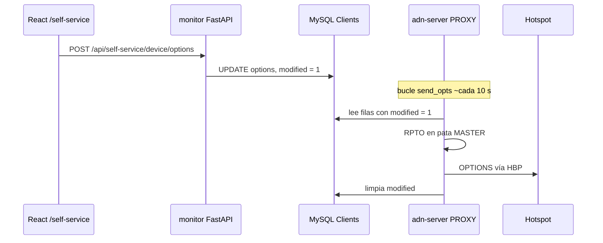

# Self-service

**Self-service** permite al dueño de un hotspot **iniciar sesión** en el panel, **editar las opciones de su dispositivo** (listas estáticas de TG, reflector por defecto, temporizador, idioma, etc.) y que esas opciones se **envíen al ADN DMR Peer Server** sin editar YAML a mano en el servidor.

Intervienen **cuatro** piezas: **MySQL** (tabla `Clients`), **API del monitor** (FastAPI, sesión + REST), **React** (página `/self-service`) y el **proxy hotspot integrado** en **adn-server** (**RPTO** periódico al master). El **peer server** es quien aplica al final **RPTO** / **OPTIONS** al bridge en ejecución y al comportamiento del hotspot.

---

## Requisitos previos

1. Bloque **`SELF_SERVICE`** en **`adn-monitor.yaml`** con credenciales **MySQL** válidas y parámetros **PBKDF2** alineados con tu herramienta de contraseñas (misma sal/iteraciones que **`hotspot_proxy_self_service.py`** cuando se use).
2. **`DASHBOARD.SELF_SERVICE: true`** para que la UI muestre la entrada **Self-service** (y `monitor.py` exponga `/api/self-service/*` cuando la BD conecta).
3. Tabla **`Clients`** con filas: **`callsign`**, **`int_id`** (ID DMR), **`psswd`** (hex PBKDF2-SHA256), **`options`** (línea `KEY=value` separada por `;`), **`logged_in`**, **`host`**, **`modified`**, etc. (ver esquema / migraciones en el repo adn-monitor).
4. El tráfico del hotspot debe pasar por el **proxy** si dependes de **`modified`** y del envío **RPTO** (ver flujo abajo).

---

## Autenticación

| Endpoint | Uso |
|----------|-----|
| **`POST /api/auth/login`** | Cuerpo: `callsign`, `password`. Verifica hash **PBKDF2** contra **`Clients.psswd`** en filas con **`logged_in = 1`**. Éxito: cookie de sesión con **`user_id`**, **`int_ids`** (todos los DMR ID de ese indicativo). |
| **`GET /api/auth/login-by-ip`** | Opcional: una coincidencia de usuario por **`Clients.host`** = IP del cliente (misma forma de sesión). |
| **`POST /api/auth/logout`** | Cierra sesión. |
| **`GET /api/auth/me`** | Devuelve `{ callsign, int_ids, selected_int_id }` para React. |

La sesión se prolonga con actividad (**SelfServiceController** usa un timeout largo de inactividad).

---

## API de dispositivo (tras login)

| Método | Ruta | Uso |
|--------|------|-----|
| **GET** | `/api/self-service/device?int_id=` | Carga fila **`Clients`** para ese **`int_id`** (debe estar en **`int_ids`** de sesión). JSON: **`int_id`**, **`callsign`**, **`mode`**, **`options`** parseadas en listas TS1/TS2, DIAL, VOICE, LANG, SINGLE, TIMER. |
| **POST** | `/api/self-service/device/options` | Cuerpo: **`int_id`**, cadena **`options`** (línea Homebrew **OPTIONS**). Debe terminar en **`;`**. Longitud máx. **4096**. Actualiza BD: **`Clients.options`**, **`modified = 1`**. |
| **GET** | `/api/self-service/device/modified?int_id=` | Devuelve **`{ modified: 0|1 }`** desde **`Clients.modified`** (la UI puede hacer polling hasta que el proxy lo limpie). |
| **POST** | `/api/self-service/device/select` | Cuerpo: **`int_id`** — fija **`selected_int_id`** en sesión si el usuario tiene varios dispositivos. |

---

## Flujo extremo a extremo (cómo llegan las opciones al hotspot)



1. El usuario guarda opciones en la web → la **API del monitor** escribe **`Clients.options`** y **`modified = 1`**.
2. El **proxy hotspot** ejecuta **`send_opts`** en bucle (~cada **10 s**). Para filas con **`modified = 1`**, lee opciones de la BD, envía **RPTO** **al peer server** en **`(MASTER, puerto_destino_asignado)`**, luego limpia **`modified`** en la BD.
3. El **ADN DMR Peer Server** recibe **RPTO** en la pata MASTER y actualiza su estado **OPTIONS** / bridge (mismo camino que un refresco normal de registro del hotspot).
4. El servidor envía la señalización adecuada al **hotspot** para que TG estáticos / reflector / temporizador surtan efecto **sin** reinicio completo del hotspot (el comportamiento coincide con el flujo HBP **OPTIONS** del servidor).

Importante: el proxy envía **RPTO solo al master**, no al hotspot directamente. Si el proxy no está en el camino, necesitas otro mecanismo que aplique **OPTIONS** o ejecutas el servidor sin este camino proxy.

> **Prerrequisito:** el hotspot debe enviar `PASS=` en su línea OPTIONS para
> login por contraseña y sincronización bidireccional con la BD. Si el hotspot
> envía contenido explícito (TGs, SINGLE, etc.) **sin** `PASS=`, el servidor
> toma las opciones directamente de esa línea y la fila de la BD se ignora. Si
> el hotspot no envía RPTO (el timer expira) o envía OPTIONS vacío, el servidor
> hace fallback a la base de datos.
> Ver [Proxy hotspot — comportamiento de la línea OPTIONS](../server/user-guide/hotspot-proxy.md#comportamiento-de-la-linea-options).

---

## Hash de contraseñas

**`AuthenticateUser`** usa:

```text
hash_pbkdf2('sha256', password, PBKDF2_SALT, PBKDF2_ITERATIONS)
```

almacenado en hex en **`Clients.psswd`**. Los mismos parámetros deben usarse donde se **registran** contraseñas (p. ej. **hotspot_proxy_self_service.py** en el repo de tooling / adn-dmr-server).

---

## Interfaz

- Ruta **`/self-service`** en React (`SelfService.tsx`): carga **`/api/auth/me`**, luego detalle del dispositivo para **`selected_int_id`**, edita la cadena de opciones, guarda.
- Un enlace externo **SelfCare** (p. ej. `selfcare.adn.systems`) puede aparecer en el nav como producto aparte — no es el mismo que este **self-service local**.

---

## Ver también

- [Inicio de la documentación](../README.md)
- [Configuración](configuration.md) — `SELF_SERVICE`, `DASHBOARD`, `PROXY`
- [Arquitectura](architecture.md) — proxy + canal de informes
- Detalle del proxy: **`proxy/README.md`** en adn-monitor (tabla de temporización RPTO)
