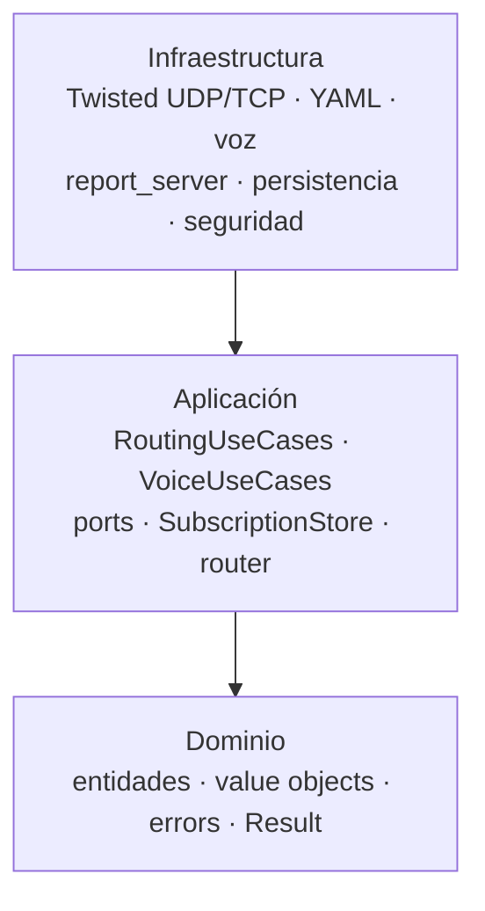

# Arquitectura (capas limpias)

## Capas

1. **Dominio** (`src/adn_server/domain/`) — entidades, objetos de valor, errores, `Result`. Sin E/S, sin Twisted.
2. **Aplicación** (`src/adn_server/application/`) — casos de uso (`RoutingUseCases`, `VoiceUseCases`, …) y **ports** (interfaces).
3. **Infraestructura** (`src/adn_server/infrastructure/`) — config YAML, Twisted UDP/TCP, voz, persistencia, adaptadores de seguridad.

**Regla de dependencias:** infraestructura → aplicación → dominio (solo hacia dentro).

## Punto de entrada

`main.py` cablea configuración, temporizadores **LoopingCall**, fábricas para **HBPProtocol**, servidor de informes e inyecta casos de uso.

## Autoridad de enrutado en runtime

El enrutado de voz lo gobierna **`SubscriptionStore`** (suscripciones de dominio). `RoutingUseCases` orquesta `dmrd_received` y delega la resolución de reenvío a **`SubscriptionRouter`**.

Comparación conceptual con **`BRIDGES`** legacy: [BRIDGES vs Subscriptions](bridges-vs-subscriptions.md).

Cambios de rendimiento en 2.x (índices, informes, proxy integrado): [Rendimiento (2.x)](performance.md).

- **`InMemoryAclRouter`** (port `AclRouter`) — solo comprobaciones ACL (`acl_check`).
- **`routing_table_for_report()`** — shim de exportación para monitor/informes (forma legacy BRIDGE_SND); no se usa para reenvíos en runtime.

Los opcodes wire y claves YAML pueden seguir diciendo “bridge” por compatibilidad con el monitor legacy (`BRIDGE_SND`, `GEN_STAT_BRIDGES`).

## Dónde leer código

| Tema | Ubicación |
|------|-----------|
| Enrutado de voz, `dmrd_received`, reenvío OpenBridge | `application/routing_use_cases.py`, `application/routing/` |
| Store de suscripciones, router, reglas in-band | `application/subscription/` |
| HBP / OpenBridge UDP | `infrastructure/twisted_adapters/udp_hbp.py` |
| Informes TCP | `infrastructure/twisted_adapters/report_server.py` (fábrica), eventos de routing desde casos de uso |
| Voz / TTS | `application/voice_use_cases.py`, `infrastructure/voice/` |
| Proxy hotspot (fan-in) | `infrastructure/proxy/` (`udp_fanin.py`, `runtime.py`), casos de uso en `application/proxy/` |
| Self-service (MySQL) | `infrastructure/proxy/self_service_bridge.py`, `infrastructure/proxy/persistence/` |

## Configuración como estado compartido

Un **`config` dict** mutable se pasa por adaptadores; actualizaciones en tiempo de ejecución (opciones, `SUB_MAP`, `_bcsq` OpenBridge) permanecen visibles globalmente durante la vida del proceso.
