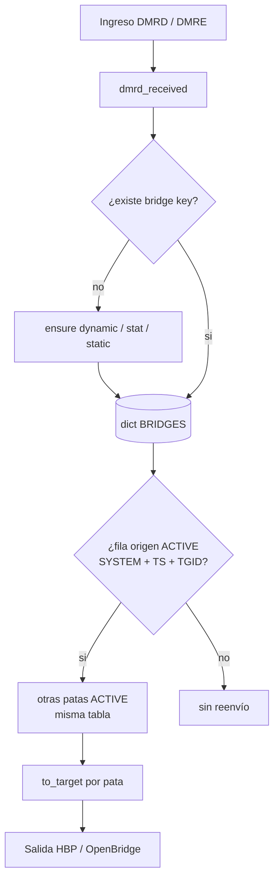
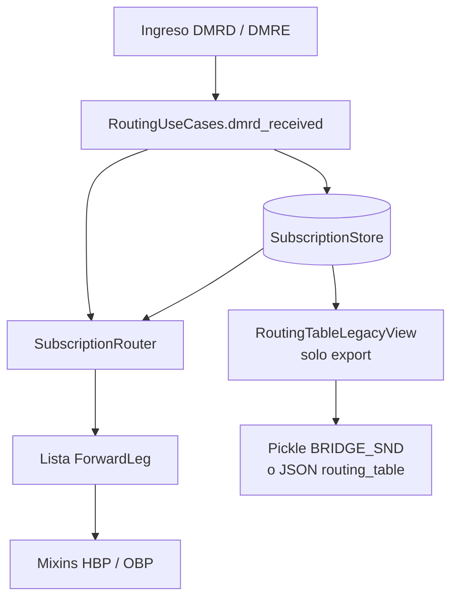

# BRIDGES (legacy) vs Subscriptions (servidor nuevo)

**adn-dmr-server** y **adn-server 2.x** reenvían voz de grupo igual en el wire: una “tabla de bridge” por talkgroup decide qué **systems** reciben copia del stream, con **reescritura LC** por pata. Lo que cambia en 2.x es **cómo se representa esa tabla en código** — no las reglas visibles para el operador.

## Para el operador

En runtime el comportamiento de bridges es el mismo: TG, slots, OPTIONS, UA, TG 4000, OpenBridge. **Subscriptions** es el nombre interno del motor de enrutado en 2.x; no es un modo de operación distinto ni algo que configures aparte.

**Sin cambios operativos**

- Configuración: **`SYSTEMS`**, OPTIONS del hotspot, **`SELF_SERVICE`** / MariaDB — igual que con **adn-dmr-server**. No hay bloque `BRIDGES` en YAML en ninguno de los dos.
- Paridad de reglas: fila origen ACTIVE, tablas `#…`, timers UA, `GEN_STAT_BRIDGES`, etc.

**Mejoras reales en 2.x**

| Área | Efecto |
|------|--------|
| **Estabilidad del enrutado** | El estado de bridges vive en un store dedicado; informes y timers ya no comparten la misma estructura mutable que el forward de voz. Menos desvíos entre lo que reenvía el servidor y lo que muestra el panel bajo carga. |
| **Monitor** | **Informe v2** (`routing_table`, `topology`) hacia **adn-monitor 2.x** sustituye pickle/CSV; el BTABLE refleja mejor el estado del peer. |
| **TG dinámicos** | Con **`DATABASE`**, los dinámicos por peer se **persisten** y se restauran al reconectar (≥ 2.0.0-rc.3). |
| **Evolución** | Parches de timers, OpenBridge, ACL o self-service no pasan por un dict global compartido con todo el proceso. |

El término **subscription** solo importa si lees código o esta guía; en el panel y en el aire sigues hablando de **bridges** y **talkgroups**.

---

## Resumen

| | **Legacy (`adn-dmr-server`)** | **Nuevo (`adn-server` 2.x)** |
|---|------------------------------|------------------------------|
| **Autoridad en runtime** | Dict global `BRIDGES` (`bridge_master.py`) | **`SubscriptionStore`** (objetos `Subscription` de dominio) |
| **Estructura** | `bridge_key → [ fila, fila, … ]` | Una **subscription** por pata de system en un canal |
| **Resolución de reenvío** | Recorrer filas, llamar `to_target` | **`SubscriptionRouter.resolve()`** → `ForwardLeg` |
| **Wire monitor / informes** | Pickle `BRIDGE_SND` = `BRIDGES` | JSON `routing_table` (v2) o export `BRIDGES` (compat v1) |
| **Bloque YAML `BRIDGES:`** | No se carga desde config en ninguno; filas en runtime | Igual — filas desde OPTIONS, UA, STAT, OpenBridge, bootstrap echo |

El comportamiento observable (guardia de fila origen, UA dinámico, TG estática, claves reflector `#…`, match OpenBridge TS1, timers) sigue **paridad legacy** con `bridge_master.py`.

## Legacy: dict `BRIDGES`

En **adn-dmr-server**, el estado de enrutado es un **diccionario global**:

```text
BRIDGES["52090"] = [
  { "SYSTEM": "MASTER-A", "TS": 2, "TGID": b'...', "ACTIVE": True,  "TO_TYPE": "ON",  "TIMER": …, … },
  { "SYSTEM": "MASTER-B", "TS": 2, "TGID": b'...', "ACTIVE": True,  "TO_TYPE": "ON",  … },
  { "SYSTEM": "OBP-UK",   "TS": 1, "TGID": b'...', "ACTIVE": False, … },
]
BRIDGES["#310"] = [ … ]   # tablas reflector / marcado
```

Cada **fila** es una pata. Campos importantes:

- **`SYSTEM`** — nombre del system configurado (master HBP o pata OpenBridge).
- **`TS`** — slot 1 o 2 (fuentes OpenBridge usan **TS 1** en el match).
- **`TGID`** — bytes de destino para **reescritura LC** hacia esa pata.
- **`ACTIVE`** — la pata participa en el reenvío si es true.
- **`TIMEOUT` / `TIMER` / `TO_TYPE` / `ON` / `OFF` / `RESET`** — timers UA, static/stat, reglas VTERM in-band.

**Camino de voz (`dmrd_received`):**

1. Obtener **clave de bridge** desde la TG destino (y tablas `#…` cuando aplica).
2. Crear tabla dinámica si no existe (UA / STAT / OPTIONS estáticas — mismos disparadores que legacy).
3. Buscar **fila origen ACTIVE** que coincida con **system + slot + TGID** actuales.
4. Por cada otra fila **ACTIVE** en **esa misma tabla**, llamar **`to_target`** (contención, ACL, LC/TA, control de bucle OpenBridge).



El monitor lee el **mismo dict** vía pickle **`BRIDGE_SND`**.

## Servidor nuevo: `Subscription` + `SubscriptionStore`

En **adn-server 2.x**, el **modelo de dominio** sustituye filas ad hoc:

- **`AudioChannel`** — TG lógica + slot `(tgid, slot)`.
- **`Subscription`** — participación de un system: **role**, **política de activación**, **state** (fase, timer), **target_tgid** (LC), **`relay_table_key`** opcional (tablas `#…`).
- **`SubscriptionStore`** — única **autoridad de enrutado** en runtime (sin mutar `BRIDGES` en paralelo).

**Camino de voz** (misma semántica, otros tipos):

1. `RoutingUseCases.dmrd_received` actualiza el store (crear relay, TG estática, timeout UA — hooks legacy).
2. **`SubscriptionRouter.relay_tables_with_active_source`** — tablas donde el system de ingreso tiene subscription **ACTIVE** para slot/TG.
3. **`SubscriptionRouter.resolve`** — devuelve **`ForwardLeg`** (system, slot, tgid) del resto de subscriptions **ACTIVE** en esas tablas.
4. Mixins de forward envían paquetes (paridad `to_target`).



**Importante:** `routing_table_for_report()` / **`BRIDGE_SND`** es un **export unidireccional** para paneles (`RoutingTableLegacyView`). **No** decide reenvíos. Evita el patrón legacy de mutar un dict global compartido con informes.

## Mapeo fila → subscription

| Fila legacy `BRIDGES` | `Subscription` de dominio |
|-----------------------|---------------------------|
| Clave tabla (`"52090"`, `"#310"`) | `relay_table_key` + TG del canal |
| `SYSTEM` | `system` (`SystemId`) |
| `TS` + contexto TG | `channel.slot` / `channel.tgid` |
| `TGID` (bytes) | `target_tgid` (reescritura LC) |
| `ACTIVE` | `state.phase` (`ACTIVE` / `IDLE`) |
| `TIMER` | `state.timer_expires_at` |
| `TIMEOUT` | `timeout_seconds` |
| `TO_TYPE` (`ON`, `OFF`, `STAT`, `NONE`) | `role` + `policy` |
| `ON` / `OFF` / `RESET` | `triggers` (`InbandTriggers`) |

Helpers import/export: `routing_table_import.py`, `routing_table_export.py` (espejo de `bridges_export` legacy).

## Comparación extremo a extremo (un frame de voz)

```mermaid
sequenceDiagram
  participant Radio
  participant Server
  participant Peer as Otro system

  Radio->>Server: Voz grupo TG 52090 TS2

  rect rgb(40,40,50)
    note right of Server: Legacy
    Server->>Server: ¿Fila origen ACTIVE en BRIDGES["52090"]?
    Server->>Server: foreach pata ACTIVE en tabla
    Server->>Peer: to_target (reescribe LC)
  end

  rect rgb(30,50,40)
    note right of Server: Servidor nuevo (mismas reglas)
    Server->>Server: SubscriptionRouter.resolve()
    Server->>Peer: forward ForwardLeg(s)
  end
```



## Lo que **no** cambió

- **Claves** de bridge (`52090`, `#reflector`, …) y tablas **multi-pata**.
- **Guardia de fila origen** — reenviar solo desde una tabla donde **este** system es origen ACTIVE para ese contexto TG/slot.
- **UA dinámico**, **OPTIONS estáticas**, **`GEN_STAT_BRIDGES`**, **TG 4000**, bootstrap **echo 9990**.
- Pasadas de timer (`rule_timer`, `bridgeDebug`, …) — misma tabla lógica, implementada sobre el store en 2.x.

## Ejemplo concreto

**Bridge** (concepto de red): “la TG 52090 une estos systems y reenvía voz entre ellos”.  
**Subscription** (solo en código 2.x): **una pata** de esa tabla — p. ej. “MASTER-A en TG 52090, slot 2, ACTIVE, con su LC y timer”.

No es bridge *o* subscription: en 2.x un bridge **es** un conjunto de subscriptions sobre el mismo canal (TG + slot).

### Escenario

Alguien habla en **TG 52090** y deben oírlo **MASTER-A**, **MASTER-B** y una pata **OpenBridge**. En el panel y en el aire eso es un **bridge** (tabla de la TG 52090).

**Legacy (`adn-dmr-server`)** — todo en un dict global:

```text
BRIDGES["52090"] = [
  { SYSTEM: "MASTER-A", TS: 2, ACTIVE: True,  TGID: …, TIMER: … },
  { SYSTEM: "MASTER-B", TS: 2, ACTIVE: True,  TGID: … },
  { SYSTEM: "OBP-UK",   TS: 1, ACTIVE: False, TGID: … },
]
```

Cuando llega un frame de voz:

1. Buscar la fila donde **este** system es origen **ACTIVE** (mismo TG/slot).
2. Recorrer las **demás filas ACTIVE** de la misma tabla.
3. Por cada una, **`to_target`** → reenvío con LC reescrito.

El monitor lee **el mismo dict** (pickle **`BRIDGE_SND`**).

**Servidor nuevo (`adn-server` 2.x)** — misma tabla, otro formato interno:

```text
SubscriptionStore — TG 52090 / slot 2:
  - subscription MASTER-A  (ACTIVE, target_tgid, timer…)
  - subscription MASTER-B  (ACTIVE, …)
  - subscription OBP-UK    (IDLE, …)
```

Cuando llega voz, **`SubscriptionRouter.resolve()`** aplica las **mismas reglas** (origen ACTIVE, resto de patas ACTIVE) y devuelve **`ForwardLeg`** para reenviar. El monitor recibe una **vista exportada** (`BRIDGE_SND` o JSON **`routing_table`**); esa exportación **no** decide el reenvío.

## Dónde leer código

| Tema | Legacy | Nuevo |
|------|--------|-------|
| Ingreso voz | `adn-dmr-server/bridge_master.py` (`routerHBP.dmrd_received`) | `application/routing_use_cases.py` |
| Reenvío a pata | `to_target` | `application/routing/hbp_forward.py`, `obp_forward.py` |
| Estado tabla | `BRIDGES` global | `application/subscription/` (`store`, `router`, ops) |
| Export monitor | `send_routing_table` / pickle | `routing_table_legacy_view.py`, informe v2 `routing_table` |

Ver también: [Bridges y talkgroups](../user-guide/bridges-and-talkgroups.md), [Arquitectura](architecture.md), [Rendimiento (2.x)](performance.md), [Protocolo de informes v2](../protocols/report-v2.md#routing_table).
