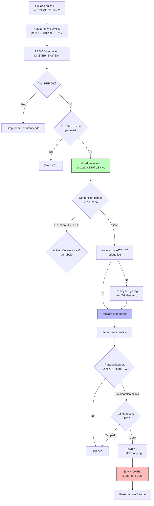
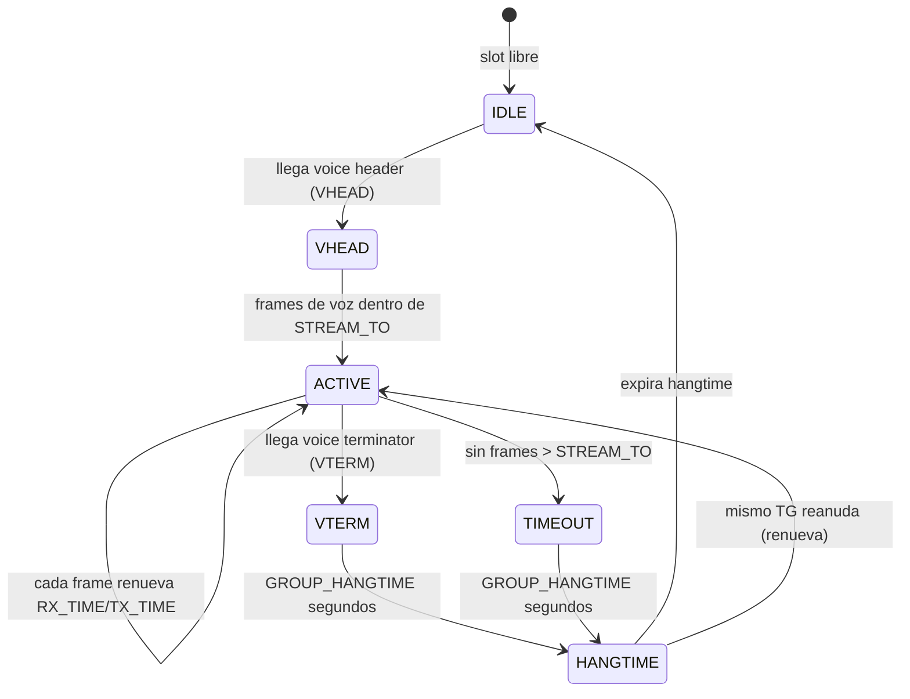
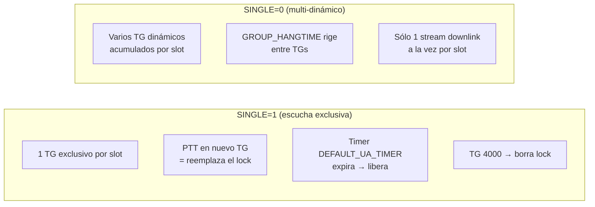
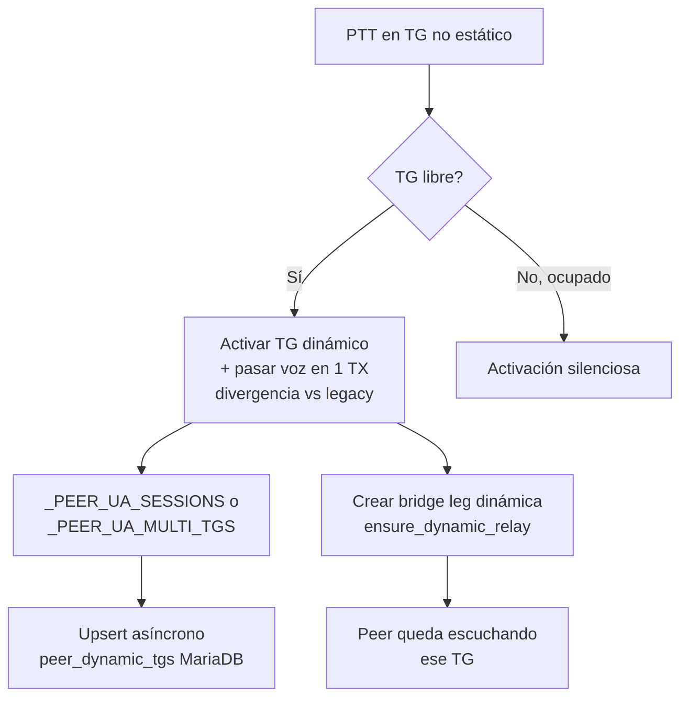
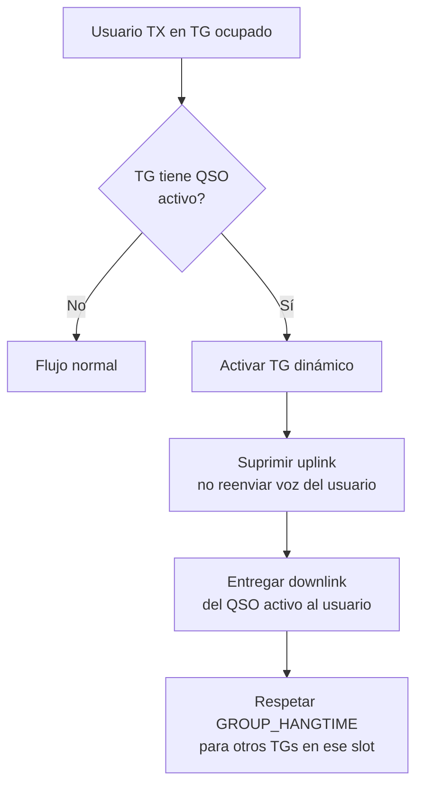
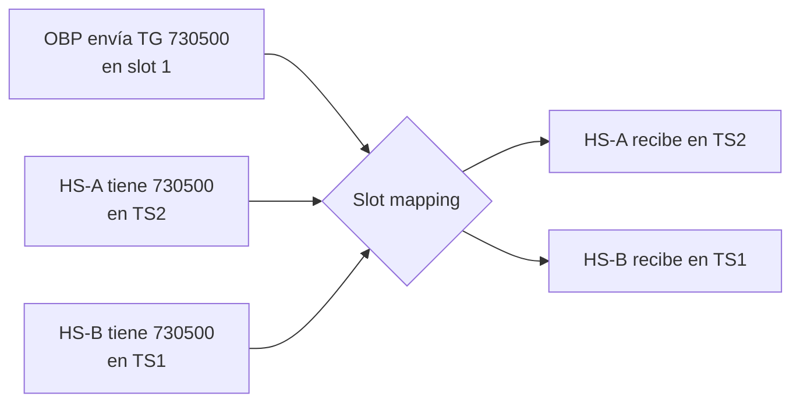
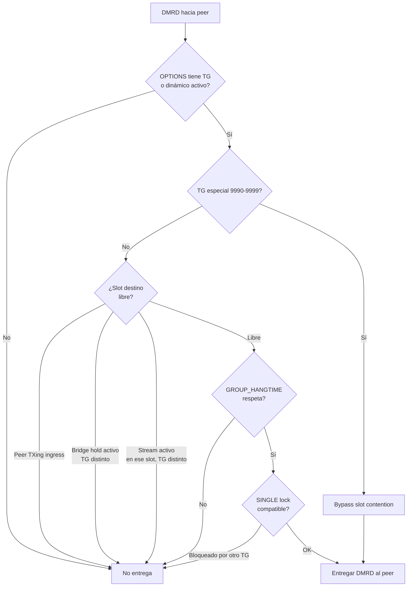

# Enrutado de voz y reglas de contención

Esta página documenta **cómo viajan los paquetes de voz por el servidor** y las
**reglas de contención / slot** que determinan quién escucha qué. Es la
referencia para sysops e integradores que necesitan entender o diagnosticar el
comportamiento de enrutado sin leer el código fuente.

El servidor mantiene **paridad legada** con `adn-dmr-server` (`bridge_master.py`)
salvo las divergencias explícitamente documentadas al final de esta página.

---

## Regla de oro: una conversación por TG

**Sólo una conversación por TG puede existir en el servidor a la vez.** Esta
regla es **global** — aplica sin importar el slot, el peer o el origen del
tráfico (OBP o HBP). Tiene la prioridad más alta; todas las demás reglas se
subordinan a ella.

Un TG está **ocupado** cuando tiene un stream de voz **activo** (frames dentro
de `STREAM_TO` del último paquete) en cualquier slot, venga de donde venga.

| Origen del nuevo tráfico | Comportamiento |
|---|---|
| Otro **OBP** envía el mismo TG | **Rechazar** — el TG ya está ocupado |
| Un **hotspot (HBP)** transmite al mismo TG | **Rechazar**, *o* activación silenciosa (ver abajo) |

La única excepción es la **activación silenciosa**, que **no** crea una segunda
conversación — sólo permite al usuario escuchar la existente.

---

## Flujo de paquetes de extremo a extremo



### Puntos de decisión en orden

1. **Autenticación HBP** — el peer debe estar registrado con passphrase válida.
2. **ACL** — `SUB_ACL`, `TGID_TS1_ACL`, `TGID_TS2_ACL` (si `USE_ACL`).
3. **`dmrd_received`** — actualiza `STATUS[slot]`: `RX_TIME`, `RX_TGID`,
   `RX_STREAM_ID`, `RX_TYPE`, `RX_PEER`.
4. **Contención global** — si el TG ya tiene un stream activo desde otra
   fuente, se bloquea o activa silenciosamente.
5. **Source row ACTIVE** — debe existir una pata de bridge `ACTIVE` para ese
   `system/slot/TG`. Si no existe, se crea una dinámica.
6. **Fan-out** — para cada peer del MASTER, el gate de downlink decide si
   recibe el paquete.
7. **Rewrite LC + slot mapping** — el slot destino es el del peer, no el de
   origen.

---

## Las cuatro reglas de contención (paridad legada)

Evaluadas **paquete a paquete** en `to_target` contra el `STATUS[slot]` del
sistema destino. Coinciden con `bridge_master.py` líneas ~2076–2104.

| Regla | Condición | Acción |
|---|---|---|
| **1. RX hangtime** | TG ≠ `RX_TGID` **y** `(now - RX_TIME) < GROUP_HANGTIME` | `continue` (no enruta) |
| **2. TX hangtime** | TG ≠ `TX_TGID` **y** `(now - TX_TIME) < GROUP_HANGTIME` | `continue` |
| **3. mismo TG RX activo** | TG == `RX_TGID` **y** `(now - RX_TIME) < STREAM_TO` **y** stream distinto | `continue` |
| **4. mismo TG TX, otro sub** | TG == `TX_TGID` **y** `(now - TX_TIME) < STREAM_TO` **y** otro suscriptor | `continue` |

Hechos clave:

- `RX_TIME`, `RX_TGID`, `TX_TIME`, `TX_TGID` **no se borran en VTERM**.
  Conservan el último valor hasta que otro QSO los sobrescribe — por eso el
  hangtime cuenta desde el último paquete.
- La contención se evalúa por frame, no por stream. Si un stream fue bloqueado
  por hangtime y luego el hangtime expira, los siguientes frames del mismo
  stream **sí** se reenvían.
- El flag `CONTENTION` del legado es sólo un debounce de log; no bloquea.

---

## Timeouts y constantes críticas

Estos valores definen el comportamiento observable. Cambiarlos afecta
contención, hangtime y reconexión.

| Constante | Valor | Ubicación | Rol |
|---|---|---|---|
| `STREAM_TO` | **0.36 s** | `domain/hbp_protocol.py` | Ventana para considerar un stream "activo" (entre paquetes). |
| `_STALE_PEER_SESSION_TIMEOUT` | **5.0 s** | `routing/helpers.py` | Una sesión per-peer sin frames se considera muerta (VTERM perdido). |
| `GROUP_HANGTIME` | **5 s** (default config) | por system en YAML | Bloqueo tras fin de QSO antes de aceptar otro TG en ese slot. |
| `DEFAULT_UA_TIMER` | configurable (minutos) | por system en YAML | Duración de bridges dinámicos (User Activated). |

Ver [Comportamiento y temporizadores](behaviour-and-timers.md) para los
intervalos de los bucles periódicos (`rule_timer`, `stream_trimmer`, etc.).

### Estados de un stream



**VTERM perdido:** si el MMDVM nunca envía el terminator, la sesión per-peer
expira tras `_STALE_PEER_SESSION_TIMEOUT` (5 s), liberando el slot.

---

## SINGLE=1 vs SINGLE=0 (escucha exclusiva)

`SINGLE` se configura en la línea `OPTIONS` del hotspot (ej: `SINGLE=1;`).
Controla **cuántos TG dinámicos puede tener activos un peer por slot**.



| Aspecto | SINGLE=1 | SINGLE=0 |
|---|---|---|
| TGs dinámicos por slot | **1 exclusivo** | **Varios acumulados** (`_PEER_UA_MULTI_TGS`) |
| Almacenamiento | `_PEER_UA_SESSIONS[peer][slot]` | `_PEER_UA_MULTI_TGS[peer][slot]` |
| Cambiar de TG | PTT en nuevo TG reemplaza el lock | Se suma al set; no reemplaza |
| TG 4000 | Borra la sesión del slot | Borra todos los dinámicos del peer |
| Timer | `DEFAULT_UA_TIMER` expira → libera | No expira individualmente; purga por `GROUP_HANGTIME` |
| Desactivación in-band | Agresiva: OFF/RESET/TG4000/tráfico no matching | Conservadora: principalmente TG 4000 |

### Excepciones a SINGLE

- **TG 9990 (eco):** **no** crea lock SINGLE. El eco vuelve siempre al llamante.
- **TG 4000:** **no** crea sesión UA. Es sólo comando de reset.
- **TG 9991–9999 (bajo demanda):** no crean lock SINGLE.
- **UA session propia:** un peer SINGLE=1 que activó el TG T dinámicamente
  **debe** recibir downlink de T (no se auto-bloquea).

---

## Talkgroups estáticos vs dinámicos

### TG estático

Definido en la línea `OPTIONS` del hotspot (`TS1_STATIC` / `TS2_STATIC`). El
peer siempre escucha ese TG en ese slot mientras esté conectado.

```
OPTIONS: TS1=730500;TS2=730502,730508;SINGLE=1;TIMER=60;
```

Origen de los TG estáticos:

- **OPTIONS al login (RPTO)** — el hotspot reporta su línea.
- **Self-service (panel web)** — el usuario cambia sus TG desde el navegador;
  el servidor envía un `RPTO` actualizado al MASTER.
- **Startup/reload** — `apply_startup_bridges` aplica los TG al arranque y en
  `SIGHUP`.
- **D-28 (divergencia):** **no** hay loop periódico de 26 s
  (`options_config_loop`). El refresco es por evento (RPTO, startup, fallback
  dmrd sin source).

### TG dinámico (User Activated)

Activado cuando un usuario transmite en un TG que **no** tiene estático.



**Diferencia vs legacy (`adn-dmr-server`):**

- **Legacy:** se necesitan 2 TX — la 1ª activa, la 2ª pasa voz.
- **Este servidor:** la 1ª TX hace ambas cosas (activar + pasar voz).

Ver [Persistencia TG dinámicos (MariaDB)](../user-guide/bridges-and-talkgroups.md#persistencia-tg-dinamicos-mariadb)
para la supervivencia tras reconexión.

---

## Activación silenciosa (TG ocupado con QSO activo)

**Divergencia intencionada.** Si un usuario transmite en un TG que tiene una
conversación **activa**, el servidor:

1. **No rechaza** la TX.
2. **Activa** ese TG como dinámico.
3. **No sube el uplink** del usuario (no molesta el QSO activo).
4. **Sí entrega el downlink** del QSO activo al usuario inmediatamente.



Aplica a:

- **TG no estático** que el usuario quiere escuchar.
- **SINGLE=1** cambiando de TG activo a otro con QSO en curso.

---

## Mapeo de slot en downlink

El slot por el que un peer **recibe** un TG lo determina su `OPTIONS` (si es
estático) o el slot donde lo activó (si es dinámico). **No** es el slot de
origen de la transmisión.



- **OBP siempre viaja en slot 1** del paquete. El slot es informativo del
  origen; la entrega se hace al slot del peer destino.
- Dos peers con el mismo TG en slots distintos pueden **ambos** escuchar la
  misma transmisión, cada uno en su slot.
- En **simplex (DMO)**, MMDVMHost descarta paquetes con el bit TS1; el servidor
  entrega voz de downlink en **TS2** para peers simplex.

---

## Gate de downlink: ¿un peer recibe el paquete?

Para cada peer y cada frame de voz de grupo, el servidor evalúa una cadena de
filtros. **Todos** deben pasar para que el paquete se entregue.



### Condiciones que bloquean downlink (per-peer)

| Condición | Detalle |
|---|---|
| **Ingress activo** | El peer está transmitiendo en ese slot → no recibe hasta terminar TX. |
| **Bridge hold** | El slot tiene un `bridge_hold` (ingress propio o listener) que bloquea TGs ajenos por `GROUP_HANGTIME`. |
| **Stream activo, TG distinto** | Ya hay un stream downlink activo en ese slot con otro TG → espera a que termine. |
| **GROUP_HANGTIME** | Si el último TG en ese slot fue distinto y está dentro del hangtime → bloquea. |
| **SINGLE lock incompatible** | SINGLE=1 con lock en otro TG → bloquea salvo que sea el TG del lock o el peer lo activara. |
| **Sesión stale** | Si la sesión per-peer lleva `_STALE_PEER_SESSION_TIMEOUT` sin frames, se purga y el slot se libera. |

### Mid-call join

Cuando un stream downlink termina (VTERM o timeout), el slot del peer queda
libre. El **siguiente frame** de cualquier otro TG que el peer tenga activo
(estático o dinámico) y que esté en curso en la red **se entrega sin requerir
nuevo PTT**.

Esto **no relaja** ninguna regla: GROUP_HANGTIME, SINGLE y contención per-peer
se evalúan igual que para cualquier stream. Es simplemente el comportamiento
normal cuando el slot queda libre.

---

## OpenBridge y TGs dinámicos

Si un hotspot en el servidor 7302 activó el TG 7300 dinámicamente y un
hotspot en 7301 transmite ese TG, el tráfico OBP debe llegar al hotspot 7302
aunque 7300 no esté en sus OPTIONS. La pata de bridge se activa por la sesión
UA (vía `master_dynamic_tg_slots`), que consulta tanto `_PEER_UA_SESSIONS`
(SINGLE=1) como `_PEER_UA_MULTI_TGS` (SINGLE=0).

Ver [Protocolo OpenBridge](../protocols/openbridge.md) para filtros de ingreso,
BCSQ/BCKA y detalles de DMRE v5.

---

## Divergencias vs legacy

| Comportamiento | Legacy (`adn-dmr-server`) | Este servidor |
|---|---|---|
| Activar TG dinámico (TG libre) | 2 TX: 1ª activa, 2ª pasa voz | 1 TX: activa + pasa voz |
| TX en TG ocupado | Se bloquea por contención (reglas 1–4) | Activación silenciosa: activa TG, no sube uplink, entrega downlink |
| Fin de stream → join TG activo | El peer queda en hangtime; no hay join mid-stream | Al terminar el stream, el siguiente TG activo se entrega sin nuevo PTT |
| OPTIONS refresh (loop 26 s) | `options_config_loop` cada 26 s | **D-28:** por evento (RPTO, startup, fallback dmrd) — sin loop periódico |
| `GROUP_HANGTIME` | RX + TX, por sistema, sin reset en VTERM | **Paridad** (mismo comportamiento) |
| `OPTIONS` sobrescribe `GROUP_HANGTIME` | No | **Paridad** (no se puede) |

---

## Ver también

- [Bridges y talkgroups](../user-guide/bridges-and-talkgroups.md) — el modelo
  `BRIDGES` / subscriptions.
- [Números especiales](../user-guide/special-numbers.md) — TG 4000, 999x, eco.
- [Comportamiento y temporizadores](behaviour-and-timers.md) — intervalos de
  bucles periódicos.
- [BRIDGES vs Subscriptions](bridges-vs-subscriptions.md) — modelo interno.
- [Protocolo OpenBridge](../protocols/openbridge.md) — DMRE v5, filtros de
  ingreso.
- [Proxy hotspot](../user-guide/hotspot-proxy.md) — PROXY / self-service
  integrados.
