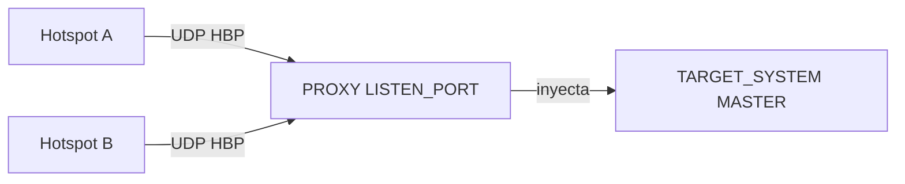

# Proxy hotspot (integrado)

**ADN DMR Peer Server** incluye un **proxy hotspot integrado**: un solo proceso (`adn-server.py`) acepta Homebrew (HBP) de muchos hotspots en un único puerto UDP e **inyecta** el tráfico en un **MASTER** configurado. **No** hace falta un proceso **`adn-proxy`** aparte cuando este modo está activo.

La configuración está en **`adn-server.yaml`**, bloques **`PROXY`** y opcional **`SELF_SERVICE`** (misma tabla MySQL **`Clients`** que **adn-monitor**).

---

## Cuándo usarlo

| Despliegue | Qué ejecutar |
|------------|--------------|
| **Stack ADN habitual** (monitor + panel + muchos hotspots Pi-Star) | **`adn-server.py`** con **`PROXY`** + **`SELF_SERVICE`**. |

El proxy integrado usa **fan-in**: los hotspots solo necesitan **`PROXY.LISTEN_PORT`** (p. ej. **62031**). El **MASTER** destino es **solo inyección** — **no** abre su propio puerto UDP para ese system (sin rango de puertos por hotspot en el host del servidor).



---

## Dependencia opcional (self-service)

El self-service con MySQL requiere **`mysqlclient`**:

```bash
pip install -e ".[selfservice]"
```

Si **`USE_SELFSERVICE: true`** pero falta **`mysqlclient`**, el arranque falla con un error claro. Pon **`USE_SELFSERVICE: false`** para usar el proxy sin BD (sin actualizaciones **RPTO** desde el panel).

---

## Claves `PROXY`

| Clave | Rol |
|-------|-----|
| **LISTEN_PORT** | Puerto UDP al que se conectan los **hotspots** (el que configuran en el dispositivo). |
| **LISTEN_IP** | Dirección de bind; vacío = todas las interfaces. |
| **TARGET_SYSTEM** | Nombre del **MASTER** en **`SYSTEMS`** que recibe el HBP inyectado (debe existir y estar **ENABLED**). |
| **TIMEOUT** | Timeout de sesión inactiva (segundos); las sesiones caducadas se eliminan en el MASTER. |
| **DEBUG** | Log detallado de paquetes. |
| **CLIENT_INFO** | Log de conexión/desconexión por ID de radio. |
| **BLACK_LIST** | Bloquea IDs de radio listados. |
| **IP_BLACK_LIST** | Bloquea IPs origen (con caducidad opcional). |

En **`PROXY`** integrado **no** hay **`MASTER`**, **`PORT`** ni **`GENERATOR`** — eso corresponde al proxy independiente legado. El MASTER destino usa **`MAX_PEERS`** (no un rango UDP) para limitar hotspots simultáneos.

Ejemplo (de `adn-server.example.yaml`):

```yaml
PROXY:
  LISTEN_PORT: 62031
  LISTEN_IP: ""
  TARGET_SYSTEM: SYSTEM
  TIMEOUT: 30
  DEBUG: false
  CLIENT_INFO: true
  BLACK_LIST: []
  IP_BLACK_LIST: {}
```

### MASTER destino solo inyección

Cuando **`PROXY.TARGET_SYSTEM`** apunta a un system (p. ej. **`SYSTEM`**), al arrancar se **eliminan** **`IP`** / **`PORT`** de ese bloque MASTER. Los hotspots nunca se conectan al puerto de conferencia; todo el HBP entra por **`LISTEN_PORT`**.

Define **`MAX_PEERS`** en el MASTER destino como máximo de hotspots simultáneos (p. ej. **102**). Otros MASTER (**ECHO**, **D-APRS**, etc.) mantienen **`IP`** / **`PORT`** normales si no son el destino del proxy.

---

## Claves `SELF_SERVICE`

Misma semántica que **`adn-monitor.yaml`** — tabla **`Clients`** compartida, flag **`modified`**, **RPTO** hacia el MASTER.

| Clave | Rol |
|-------|-----|
| **USE_SELFSERVICE** | Activa sincronización de opciones con MySQL (`true` / `false`). |
| **PBKDF2_SALT**, **PBKDF2_ITERATIONS** | Deben **coincidir** con **`adn-monitor.yaml`** para el hash de contraseñas. |

La conexión MariaDB está en el bloque **`DATABASE`** (compartido con persistencia de TG dinámicos) — ver [Configuración](configuration.md#database-mariadb).

Al arrancar el servidor registra **`(SELF_SERVICE) Database connection test: OK`** y **`(SELF_SERVICE) Enabled`** si el pool conecta. El self-service es **asíncrono**; el reenvío de voz no se bloquea por latencia de BD.

Detalle del flujo en el panel: [Self-service](../../monitor/self-service.md).

---

## Comportamiento con varios hotspots

- Cada hotspot autenticado es un **peer** en el MASTER de inyección con sus **OPTIONS** (TG estáticas). **Repeat** y el fan-out del monitor respetan **OPTIONS por peer** — el tráfico de un TG no se envía a peers que no lo tienen seleccionado.
- Los talkgroups **eco 9990–9999** omiten el filtro OPTIONS y vuelven al hotspot **llamante** (ver [Números especiales](special-numbers.md)).

---

## Comportamiento de la línea OPTIONS

Tras el login (RPTL → RPTK → RPTC), el proxy arranca un **timer de 10 s**
esperando el paquete **RPTO** del hotspot con su línea **OPTIONS**. Lo que el
hotspot envíe (o no envíe) en ese RPTO determina **quién es la fuente de
verdad** de los TG estáticos del peer:

| El hotspot envía en el RPTO | Quién define los TG | Comportamiento |
|---|---|---|
| `OPTIONS=PASS=xxxxxx;` | **Auto-servicio** (panel web) | El proxy procesa el `PASS=`, verifica la contraseña individual (PBKDF2 contra `Clients.psswd`), marca al peer como autenticado, cancela el timer de 10 s y empuja los TG de la BD al master. El usuario **puede** hacer login por contraseña y auto-login por IP en el dashboard. |
| `OPTIONS=` (vacío) | **Auto-servicio** (panel web) | El proxy lee los TG de la BD y los inyecta al master. El usuario **solo** puede usar auto-login por IP en el dashboard (sin contraseña). |
| **No envía RPTO** (el timer de 10 s expira) | **Auto-servicio** (panel web) | El proxy asume que el hotspot no tiene OPTIONS propias y hace fallback a la BD. Mismo efecto que `OPTIONS=` vacío. |
| `OPTIONS=TS2=730444;SINGLE=0;` (contenido sin `PASS=`) | **El propio hotspot** | El master toma los TG **directamente de la línea OPTIONS**. Se ignora la BD. El usuario **solo** puede usar auto-login por IP en el dashboard (sin contraseña). |

**Regla clave:** el auto-servicio es la fuente de verdad **excepto** cuando el
hotspot envía contenido explícito (TGs, SINGLE, TIMER, etc.) en su línea
OPTIONS. En ese caso, lo que dice el hotspot **priman** y el auto-servicio se ignora.

### Contraseña individual y login por dashboard

- Si el hotspot **nunca** envía `PASS=` en su RPTO, el usuario **no** podrá
  entrar al dashboard con contraseña. Solo podrá usar **auto-login por IP**
  (si su IP coincide con `Clients.host`).
- Para habilitar el login por contraseña en el dashboard, el hotspot debe enviar
  `OPTIONS=PASS=tu_contraseña;` en su configuración (Pi-Star / WPSD / MMDVM
  `optsfile`). La contraseña debe coincidir con el hash PBKDF2 almacenado en
  `Clients.psswd`.
- El flujo `PASS=` es lo que activa la sincronización bidireccional: el proxy
  almacena el hash, registra el flag `modified` y empuja los TG de la BD al master.

---

## Recarga en caliente (`SIGHUP`)

**Se aplica sin reiniciar** (las sesiones activas del proxy se mantienen):

- **`PROXY`:** **TIMEOUT**, **DEBUG**, **CLIENT_INFO**, **BLACK_LIST**, **IP_BLACK_LIST**
- **`SELF_SERVICE`:** se fusiona en config (cambios de credenciales en nuevas operaciones BD; los bucles no se reinician en reload)

**Requiere reinicio completo del proceso:**

- **`PROXY.LISTEN_PORT`** / **`LISTEN_IP`** (el cambio de bind se registra y se ignora en reload)
- **`PROXY.TARGET_SYSTEM`**
- Activar o desactivar **`USE_SELFSERVICE`** tras el arranque

Ver [Configuración — recarga en caliente](configuration.md#recarga-en-caliente-adn-serveryaml).

---

## Ver también

- [Configuración](configuration.md) — referencia completa de **`adn-server.yaml`**.
- [Monitorización e informes](monitoring.md) — informes TCP, panel, rotación de logs.
- [Self-service](../../monitor/self-service.md) — **`Clients`**, temporización **RPTO**.
